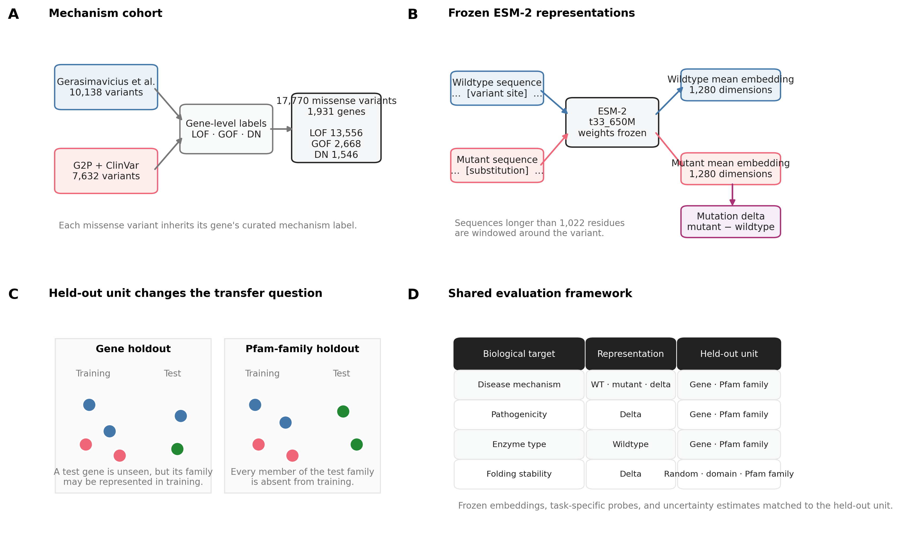
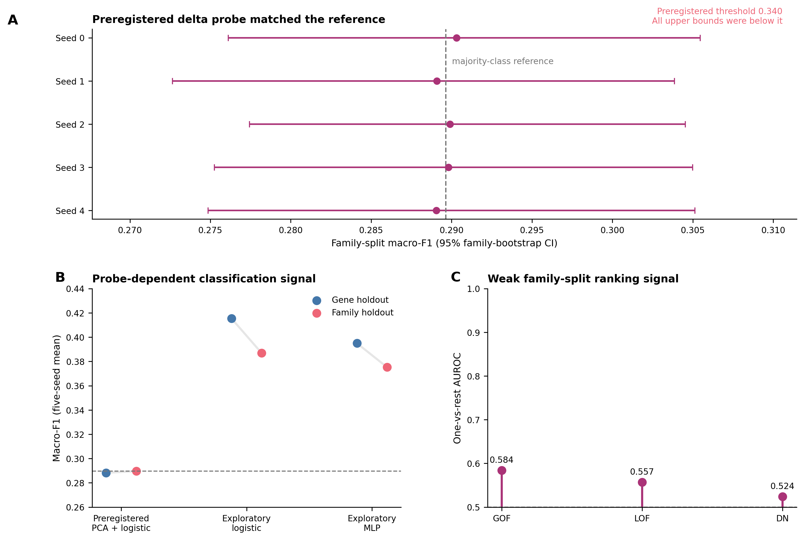
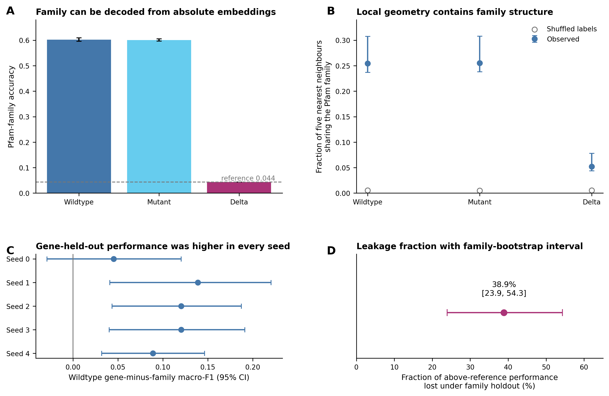
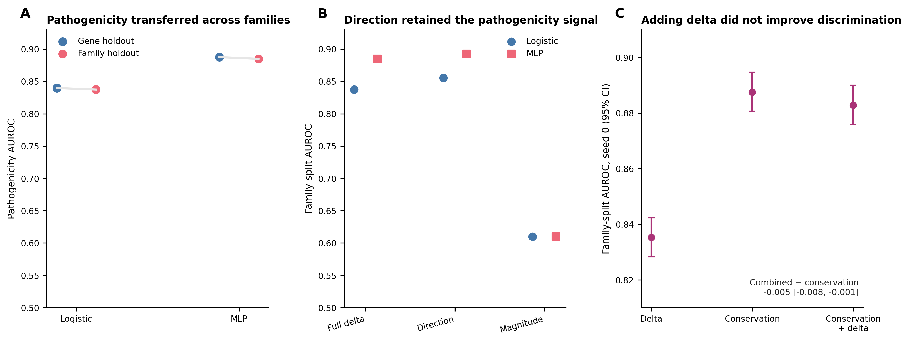
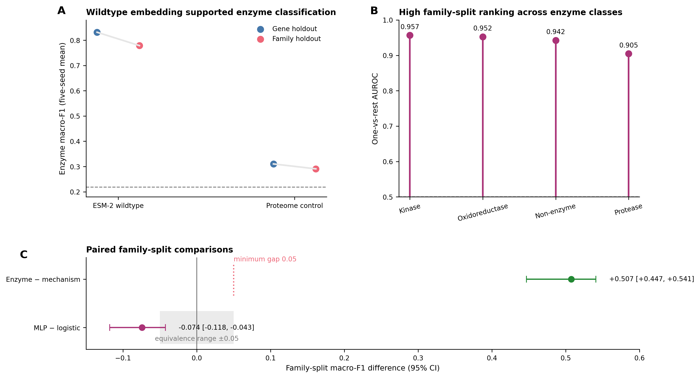
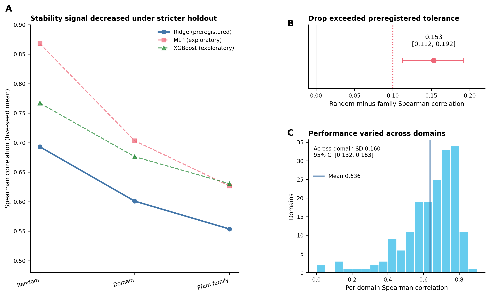

# Dissecting protein identity, mutation effects, and disease mechanism in ESM-2 embeddings

## Status

This is the working manuscript skeleton, based on the current mechanism, pathogenicity control,
geometry, enzyme classification, stability, and family-split literature-audit reports under
`reports/run_biorxiv/`. A prior draft plan is kept at `biorxiv/bak/MANUSCRIPT.md` for reference
only.

## Length

The main text should contain 3,000 to 4,000 words, excluding references, figure captions, and
supplementary material.

| Section | Target words |
|---|---:|
| Abstract | 200 |
| Introduction | 400-450 |
| Results | 1,300-1,450 |
| Discussion | 600-700 |
| Methods | 700-900 |
| Total | 3,200-3,900 |

Within Results, the mechanism and family sections (§1-3) should receive roughly half the Results
budget, since they carry the study's primary finding. Pathogenicity, conservation, enzyme, and
stability (§4-7) should stay tighter.

| Results subsection | Target words |
|---|---:|
| 1. The preregistered delta probe matches the majority-class reference | 200-250 |
| 2. Weak classification and ranking signals depend on probe choice | 200 |
| 3. Wildtype embeddings predict Pfam family | 200-250 |
| 4. Pathogenicity is recoverable across families | 125-175 |
| 5. Pathogenicity information is largely redundant with conservation | 100-150 |
| 6. Enzyme type is recoverable from the wildtype embedding | 150-200 |
| 7. Stability is recoverable but not uniformly family-robust | 200-250 |

## Abstract

Protein language models are increasingly used to predict variant effects, including pathogenicity.
Whether frozen representations can distinguish disease mechanisms under family holdout remains
unevenly studied. Here we evaluate frozen ESM-2 wildtype, mutant, and delta (mutant minus wildtype)
representations for classifying missense variants as loss-of-function, gain-of-function, or
dominant-negative, using both gene-held-out and Pfam-family-held-out evaluation. We find that
mechanism classification from the wildtype and mutant embeddings drops from gene holdout to family
holdout. Wildtype embeddings also predict Pfam family well above the majority-class baseline,
consistent with family recognition partly contributing to the gene-to-family drop. Under a
preregistered linear probe, the delta matches the majority-class reference for this classification,
while exploratory nonlinear probes recover weak performance above that reference. The same delta
representation nevertheless predicts pathogenicity and folding stability under family holdout,
though stability performance is family-dependent and uneven across protein domains. The
pathogenicity signal is largely redundant with ESM-2's own conservation score.
Wildtype embeddings also support enzyme-type classification, confirming that the representation
carries usable signal for other biological tasks. These results show that gene-held-out performance
can overstate transfer to unseen protein families. Variant-effect studies should therefore report
the held-out unit and use family- or homology-disjoint evaluation when claiming transfer beyond
represented families.

## Introduction

Protein language models such as ESM-2 are trained on large sequence databases and produce
embeddings used to predict variant effects. Whether those embeddings can predict a particular
downstream property is a separate empirical question. Performance on pathogenicity, for example,
does not establish that they can distinguish disease mechanisms.

Pathogenicity and disease mechanism are distinct properties. A pathogenic variant may abolish
protein function (loss-of-function), create or increase activity (gain-of-function), or interfere
with the product of the wildtype allele (dominant-negative). These mechanisms can have different
clinical and therapeutic consequences, so mechanism classification is separate from identifying a
variant as damaging. In this study, mechanism labels are assigned at gene level from curated
literature rather than direct variant-level assays. Each variant therefore inherits its gene's
label, and the analysis cannot represent mechanism differences among variants in the same gene.

Variant-level mechanism prediction could help clinical geneticists and functional genomics
researchers prioritize follow-up assays and distinguish variants that may inform different
therapeutic strategies. This is particularly relevant when variants in the same gene act through
different mechanisms.

The unit held out during evaluation determines the generalization claim. A variant-random split
tests interpolation within genes already represented during training. A gene-disjoint split tests
transfer to unseen genes, but members of the same protein family can remain in training, so
performance may partly reflect family-level similarity. A family- or homology-disjoint split tests
transfer beyond the families represented during training.

Recent disease-mechanism predictors handle sequence relatedness differently. LoGoFunc uses a
gene-disjoint primary test and a sensitivity analysis limiting training-to-test sequence identity to
40% (Stein et al., 2023). ClearVariant uses variant-level cross-validation without gene or family
holdout (Ha et al., 2025), whereas PreMode evaluates variants within each target gene and also tests
transfer between genes that share a domain (Zhong et al., 2025). These designs address different
generalization questions, so their performance estimates should be interpreted according to the
unit held out.

This study tests whether the frozen ESM-2 mutation delta supports disease-mechanism classification
across held-out protein families. Before the confirmatory run reported here, we preregistered the
confirmatory claims and stability-control criteria. The record also specified the primary probes,
resampling procedures, thresholds, and decision rules. Analyses outside those prospective
specifications are labeled exploratory; rules added after results were inspected are identified as
post-result amendments. The mechanism result is interpreted alongside three positive controls:
pathogenicity, folding stability, and enzyme type. These tasks use task-specific cohorts,
representations, and probes within a shared evaluation framework based on frozen ESM-2 embeddings,
family-held-out testing, and cluster-aware uncertainty estimates. They provide context for the
result of the preregistered mechanism probe at the majority-class reference. The study design and
shared evaluation framework are summarized in Figure 1.

Figure 1. Study design and shared evaluation framework. (A) The mechanism cohort combined curated
gene-level labels with missense variants, and each variant inherited its gene's loss-of-function,
gain-of-function, or dominant-negative label. (B) Wildtype and mutant sequences were embedded
separately with frozen ESM-2. Mean-pooled wildtype, mutant, and mutation-delta representations were
retained. (C) Gene holdout excluded each test gene while allowing related family members in
training; Pfam-family holdout excluded all members of each test family. (D) Mechanism,
pathogenicity, enzyme-type, and folding-stability analyses used task-specific representations and
held-out units within the shared framework.

## Results

### 1. The preregistered delta probe matches the majority-class reference
Source: `report_mechanism.md`.
Under family holdout, the preregistered linear probe on the mean-pooled mutation delta scored a
five-seed mean macro-F1 of 0.290, equal to the measured majority-class reference of 0.290. Across
all five seeds, the upper 95% family-bootstrap confidence bound remained below 0.340, the measured
reference plus the preregistered margin of 0.05. In seed 0, macro-F1 was 0.290 with a 95% confidence
interval of 0.276 to 0.305. Wildtype-only and mutant-only embeddings scored above the reference but
dropped when moving from gene split to family split (wildtype-only: 0.552 to 0.450; mutant-only:
0.549 to 0.451). Mutant-only performance was nearly identical to wildtype-only performance,
indicating little classification benefit from using the mutant rather than the wildtype
representation under this probe (Figure 2A).

A single-source analysis restricted to 10,138 Gerasimavicius variants reproduced the main pattern
without the G2P additions. Using references recomputed for this subset, the delta matched the
majority-class reference at reported precision under both gene holdout (0.279 versus 0.279) and
family holdout (0.280 versus 0.280). Wildtype macro-F1 decreased from 0.611 to 0.462. The main
pattern therefore did not depend on adding the G2P-derived cohort (Supplementary Figure S1).

### 2. Weak classification and ranking signals depend on probe choice
Source: `report_mechanism.md`.
The delta's macro one-vs-rest AUROC ranged from 0.532 to 0.578 across seeds. The five-seed
family-split AUROC was 0.584 for gain-of-function, 0.557 for loss-of-function, and 0.524 for
dominant-negative. Ranking performance was strongest for gain-of-function, while dominant-negative
remained close to the 0.500 no-signal value. Family-block permutation tests detected ranking signal
in four of five seeds (p = 0.029, 0.003, 0.011, 0.003, 0.054). Thus, although the preregistered
linear probe matched the majority-class reference in macro-F1, it retained weak ranking
information.

Exploratory probes recovered additional classification performance. In one analysis, a
full-dimensional, standardized, class-balanced logistic regression decreased from macro-F1 0.415
under gene holdout to 0.387 under family holdout. In a separate nonlinear analysis, an MLP
decreased from 0.395 to 0.375. Both family-split scores exceeded the majority-class reference of
0.290 but remained below the 0.450 obtained with the preregistered linear probe on the
wildtype-only representation. These exploratory results do not replace the preregistered result.
The probe comparison and class-specific ranking results are shown in Figure 2B and Figure 2C.

Figure 2. Disease-mechanism information in the mutation delta. (A) Family-split macro-F1 from the
preregistered within-fold PCA and logistic-regression probe across five seeds. Points show
out-of-fold estimates and bars show 95% family-bootstrap confidence intervals. The dashed line is
the majority-class reference; the preregistered threshold of 0.340 lies beyond the displayed axis,
and every upper confidence bound remained below it. (B) Five-seed mean macro-F1 under gene and
Pfam-family holdout for the preregistered probe and two exploratory probe specifications. (C)
Five-seed family-split one-versus-rest AUROC for gain-of-function, loss-of-function, and
dominant-negative variants. The dashed line marks the 0.500 no-signal value.

### 3. Wildtype embeddings predict Pfam family
Source: `report_mechanism.md`.
In a subset of 755 genes spanning 145 Pfam families, a linear probe predicted family from the
wildtype embedding with a five-seed mean accuracy of 60.2%, compared with a 4.37% majority-class
baseline. Applied to the mutation delta, the same probe matched the baseline at 4.37%. In a
classifier-independent nearest-neighbour analysis, 25.4% of each wildtype embedding's five
nearest neighbours shared its Pfam family, compared with 0.52% after family labels were shuffled.
The corresponding delta values were 5.2% and 0.52%, showing weaker but detectable family structure
in the delta's local geometry. The paired wildtype gene-to-family gap was positive in all five
seeds, ranging from 0.045 to 0.139, and the corresponding 95% family-bootstrap intervals excluded
zero in four of five seeds. This gap represented 38.9% of the wildtype embedding's gene-split
performance above the majority-class reference, with a 95% confidence interval of 23.9% to 54.3%.
These family-readability, split-gap, and leakage-fraction analyses are shown in Figure 3.

Figure 3. Pfam-family information and the gene-to-family performance gap. (A) Accuracy of a linear
probe trained to classify 145 Pfam families from wildtype, mutant, or delta representations. Bars
show five-seed means with standard deviations; the dashed line is the majority-class reference.
(B) Fraction of each representation's five nearest neighbours that shared its Pfam family. Filled
points show observed values with 95% bootstrap confidence intervals; open points show shuffled
family-label references. (C) Paired wildtype gene-minus-family macro-F1 for each seed, with 95%
family-bootstrap confidence intervals. (D) Fraction of the wildtype representation's performance
above the majority-class reference that was lost under family holdout, with its 95%
family-bootstrap confidence interval.

### 4. Pathogenicity is recoverable across families
Sources: `report_pathogenicity_control.md`, `report_geometry.md`.
Under family holdout, the mean-pooled mutation delta reached a five-seed mean AUROC of 0.885 with an
MLP. The seed-0 estimate was 0.886 (95% CI 0.880-0.891), with the interval entirely above the
preregistered threshold of 0.85. The five-seed mean decreased by only 0.003 from the gene-split
result. The directional component alone yielded AUROC 0.855 with logistic regression and 0.893 with
an MLP, matching or exceeding the corresponding full-delta values, while magnitude alone remained
weaker at 0.610 under both probes (Figure 4A-B).

### 5. Pathogenicity information is largely redundant with conservation
Source: `report_geometry.md`.
In a matched seed-0 logistic-regression comparison, ESM-2's masked-marginal conservation score
reached AUROC 0.888, exceeding both the delta (0.835) and the delta-plus-conservation combination
(0.883). Adding the delta changed AUROC by -0.005 (95% CI -0.008 to -0.001). The pathogenicity
information available from the delta was therefore largely redundant with conservation in this
evaluation (Figure 4C).

Figure 4. Pathogenicity transfer, delta geometry, and conservation. (A) Five-seed mean
pathogenicity AUROC under gene and Pfam-family holdout for logistic-regression and MLP probes on the
mean-pooled mutation delta. (B) Five-seed family-split AUROC from the full delta, its directional
component, and its magnitude under exploratory logistic-regression and MLP probes. The dashed lines
in A and B mark the 0.500 no-signal value. (C) Matched seed-0 family-split logistic-regression
comparison of the delta, ESM-2 masked-marginal conservation score, and their combination. Bars show
95% family-bootstrap confidence intervals. The annotation reports the paired AUROC difference
between the combined and conservation-only models.

### 6. Enzyme type is recoverable from the wildtype embedding
Source: `report_enzyme_classification.md`.
The wildtype embedding classified enzyme type as kinase, protease, oxidoreductase, or non-enzyme
with a five-seed mean family-split macro-F1 of 0.779. The seed-0 estimate was 0.787 (95% CI
0.732-0.818), with the interval entirely above the preregistered threshold of 0.70 and a
majority-class reference of 0.219. A proteome-feature negative control reached 0.291 under the same
family holdout. On the shared set of families, the enzyme score exceeded mechanism classification
by 0.507 macro-F1 (95% CI 0.447-0.541; Figure 5A,C).

Five-seed family-split AUROC was 0.957 for kinase, 0.952 for oxidoreductase, 0.942 for non-enzyme,
and 0.905 for protease. Protease was the smallest class and had the least precise estimate (Figure
5B).

The paired MLP-minus-logistic difference was -0.074 (95% CI -0.118 to -0.043). The interval was not
wholly contained within the preregistered equivalence range of -0.05 to +0.05, so linear-nonlinear
equivalence was not established (Figure 5C).

Figure 5. Enzyme-type classification under family holdout. (A) Five-seed mean macro-F1 under gene
and Pfam-family holdout for the ESM-2 wildtype embedding and the proteome-feature negative control.
The dashed line is the majority-class reference. (B) Five-seed family-split one-versus-rest AUROC
from the logistic-regression probe for each enzyme class. The dashed line marks the 0.500 no-signal
value. (C) Paired family-split comparisons. The upper row shows enzyme-minus-mechanism macro-F1 on
the shared family subset, with the comparison minimum gap marked by the dotted line. The lower
row shows MLP-minus-logistic enzyme macro-F1, with the equivalence range shaded. Points show paired
differences and bars show 95% family-bootstrap confidence intervals.

### 7. Stability is recoverable but not uniformly family-robust
Source: `report_stability.md`.
The mean-pooled mutation delta predicted experimentally measured folding stability. Under a random
split, the seed-0 Spearman correlation from the preregistered ridge probe was 0.693 (95% CI
0.675-0.709), with the interval entirely above the threshold of 0.50. Under family holdout, the
five-seed mean fell to 0.554. On the matched seed-0 cohort, the random-to-family decrease was 0.153
(95% CI 0.112-0.192), with the interval entirely above the preregistered 0.10 boundary for family
dependence. Performance also varied among domains: the per-domain correlation standard deviation
was 0.160 (95% CI 0.132-0.183), above the registered maximum of 0.10 (Figure 6A-C).

Using the exploratory full-dimensional, standardized, class-balanced mechanism classifier,
removing a fitted stability direction changed mechanism macro-F1 by -0.0009 (95% CI -0.0025 to
+0.0007; Supplementary Figure S2).
Exploratory nonlinear probes retained family-held-out stability signal, with correlations of 0.627
for the MLP and 0.630 for XGBoost, but did not alter the preregistered linear-probe conclusions.

Figure 6. Folding-stability transfer across held-out units. (A) Five-seed mean Spearman correlation
under random, PDB-domain, and Pfam-family holdout. Ridge regression was the preregistered probe;
MLP and XGBoost were exploratory. (B) Matched seed-0 random-minus-family difference for the ridge
probe, with its 95% family-bootstrap confidence interval. The dotted line marks the preregistered
0.10 tolerance for family dependence. (C) Distribution of per-domain Spearman correlations. The
vertical line marks the across-domain mean, and the annotation reports the standard deviation and
its 95% bootstrap confidence interval.

## Methods

### 1. Mechanism cohort and labels

Gene-level disease-mechanism labels were assembled from Gerasimavicius et al. (2022) and
Gene2Phenotype (G2P). Gerasimavicius assignments took priority. G2P records were restricted to
strong or definitive gene-disease associations with an unambiguous molecular-mechanism annotation;
unresolved conflicts were excluded. Haploinsufficiency and autosomal-recessive annotations were
combined as loss-of-function (LOF); the other classes were gain-of-function (GOF) and
dominant-negative (DN). Labels were gene-level, so each variant inherited its gene's label and the
LOF class was not equivalent to a variant-level functional-assay classification.

Missense variants came from the Gerasimavicius supplementary data and from pathogenic ClinVar
records for genes covered only by G2P; likely-pathogenic records were excluded. Variants required a
UniProt identifier, an available reference sequence, a complete substitution, and agreement between
the recorded and reference wildtype residues. The final cohort contained 17,770 variants across
1,931 genes: 13,556 LOF, 2,668 GOF, and 1,546 DN. Pfam annotations covered 1,907 genes in 1,144
families.

### 2. Pathogenicity cohort

The pathogenicity control used a separate ClinVar extraction from the same target-gene universe.
The extraction retained GRCh38 single-nucleotide missense records. Records classified as
conflicting, uncertain, not provided, or other, and records without assertion criteria, were
excluded. Pathogenic and likely-pathogenic records formed the pathogenic class; benign and
likely-benign records formed the benign class.

Protein-level substitutions were deduplicated, and one substitution with conflicting class labels
was excluded. Within each gene, up to 20 variants per class were sampled with seed 42 and reduced to
equal class counts. Variants that could not be applied to the UniProt reference were removed, after
which per-gene balance was restored. The final cohort contained 24,384 variants across 1,802 genes,
with 12,192 variants per class. Family splits used 24,176 variants in 1,072 Pfam clusters; 208
variants without Pfam assignments were excluded only from those splits.

### 3. Enzyme cohort

Enzyme-type labels were derived from UniProt EC-number and keyword annotations. Genes were
classified as kinase, protease, oxidoreductase, or non-enzyme, with priority in that order when
annotations overlapped. Enzymes outside the three named classes and genes without the required
annotation were excluded. The cohort contained 1,451 genes: 130 kinases, 68 proteases, 123
oxidoreductases, and 1,130 non-enzymes. Here, non-enzyme meant no annotated EC activity. The primary
representation was the wildtype embedding; a 33-feature proteome matrix was the prespecified
negative control. Family splits included 1,429 genes in 835 Pfam clusters for the embedding and
1,422 genes in 828 clusters for the aligned proteome features.

### 4. Stability cohort

Folding-stability measurements were obtained from the Tsuboyama et al. (2023) mega-scale assay.
Single substitutions in natural PDB domains with numeric `ddG_ML` values were retained; designed
proteins, mutated backgrounds, insertions, deletions, and multi-mutants were excluded. The target
was the reported folding-stability change, ΔΔG, for 177,315 variants across 181 domains. Evaluation
used random, domain-disjoint, and Pfam-family-disjoint splits. HMMER searches against Pfam-A assigned
the best hit passing the curated gathering threshold. Fourteen unassigned domains were excluded
only from the family split, leaving 167 domains in 77 families.

### 5. ESM-2 representations

Wildtype and mutant sequences were embedded separately with frozen
`esm2_t33_650M_UR50D`. Final-layer residue representations were mean-pooled into 1,280-dimensional
vectors, and the mutation delta was mutant minus wildtype. The delta at the substituted residue was
also retained. Sequences longer than 1,022 residues were windowed around the variant. The
pathogenicity conservation score was `log P(wildtype) - log P(mutant)` at the masked variant
position.

### 6. Evaluation splits

Gene splits kept all variants from a gene in one fold; family splits kept all genes with the same
assigned Pfam accession together. Mechanism, pathogenicity, and enzyme analyses used the first Pfam
cross-reference returned by UniProt and excluded unassigned genes only from family splits.
Stability used the HMMER assignments above and also held out complete PDB domains. Five-fold
cross-validation was repeated over five seeds. Metrics were computed within folds and averaged.
Confidence intervals used 1,000 cluster-bootstrap resamples: genes for gene splits, Pfam families
for family splits, and PDB domains for stability random and domain splits.

### 7. Probes

The preregistered mechanism probe fitted up to 256 principal components and logistic regression
within each training fold, without standardization or class weighting. Exploratory mechanism probes
included full-dimensional, fold-standardized, class-balanced logistic regression and a
two-hidden-layer multilayer perceptron (MLP). Pathogenicity used fold-standardized logistic
regression and a one-hidden-layer MLP; enzyme classification used logistic regression and the
two-layer MLP. The preregistered stability probe was fold-standardized ridge regression with an L2
penalty of 1.0. Other stability models were exploratory. No classifier estimated calibrated clinical
risk. Full hyperparameters are reported in Supplementary Methods.

### 8. Preregistration and statistics

The statistical plan was written and committed before the confirmatory run and is retained with its
revision history in the version-controlled analysis repository. It specified the prospective
claims, stability controls, primary probes, thresholds, resampling procedures, and decision rules.
Analyses outside those specifications were exploratory. Dated post-result amendments recorded
protein-level deduplication and seed-0 inference for pathogenicity, seed-0 inference for the
conservation comparison, and the numerical enzyme-comparison threshold. These rules were not
prospective; the affected analyses were rerun under the amended specifications.

Primary metrics were macro-F1 for multiclass classification, one-versus-rest AUROC for class
ranking, binary AUROC for pathogenicity, and Spearman correlation for stability. Always-LOF and
always-non-enzyme classifiers supplied the multiclass references; AUROC and Spearman no-signal
values were 0.500 and 0.000. Mechanism ranking used 1,000 family-block label permutations per seed.
The mechanism classification, ranking, and gene-to-family claims used their prespecified
three-of-five seed rules. Other threshold tests used seed-0 out-of-fold predictions and
cluster-bootstrap intervals for inference; five-seed means were descriptive.

## Discussion

A central finding was that mechanism-classification performance from frozen ESM-2 wildtype and
mutant embeddings dropped when evaluation moved from held-out genes to held-out Pfam families.
Wildtype embeddings also predicted Pfam family well above the majority-class baseline, despite
containing no mutation information. Together, these observations suggested that gene-held-out
performance may partly reflect family-specific associations learned from other members of the same
family, which were absent under family holdout. The wildtype mechanism classifier performed better
under gene holdout in all five seeds, and the family-bootstrap intervals excluded zero in four of
five seeds. However, these analyses did not show that family membership predicted mechanism labels
beyond class imbalance, so they did not establish family recognition as the cause of the gap.

Under family holdout, the preregistered linear probe on the mutation delta matched the
majority-class reference for three-class disease-mechanism classification. This did not establish
that the delta contained no mechanism information. Permutation testing detected ranking signal in
four of five seeds, and exploratory probes recovered modest above-reference classification. These
findings together indicated weak, probe-dependent signal but did not change the preregistered
classification result.

The mutation delta predicted pathogenicity and folding stability, while the wildtype embedding
predicted enzyme type. These controls showed that the shared evaluation framework could recover
biological signals from frozen ESM-2 embeddings under family holdout. On the shared family subset,
enzyme classification exceeded mechanism classification by 0.507 macro-F1, with a paired 95%
bootstrap interval from 0.447 to 0.541. Because the controls used task-specific cohorts,
representations, and probes, they did not establish equal task difficulty or label quality.

The pathogenicity signal from the mutation delta was substantially redundant with ESM-2's
masked-marginal conservation score. Conservation alone outperformed the delta, and adding the delta
slightly reduced discrimination. The delta's direction retained nearly all
pathogenicity performance, whereas its magnitude was much weaker. This comparison did not establish
that conservation is the delta's only content. Zhong and Shen (2022) report a related zero-shot
contrast:
ESM1b reaches AUROC 0.922 for
pathogenicity but 0.541 to 0.653 for GOF-versus-LOF classification across four families. Their
trained RESCVE model improves on the zero-shot score in three of the four tasks, and they argue that
mechanism prediction should be family-specific. Their evaluation therefore tests prediction within
known families rather than transfer to unseen families.

Folding stability remained predictable under family holdout, but both the random-to-family decline
and cross-domain variability exceeded their preregistered limits. Exploratory nonlinear probes
improved absolute performance but did not change these linear-probe conclusions. Mutation-level
information therefore remained usable while transferring unevenly across protein families.

Existing mechanism predictors use different held-out units. Among the studies reviewed, LoGoFunc
is the closest precedent, with a gene-disjoint primary test and a sensitivity analysis limiting
training-to-test sequence identity to 40% (Stein et al., 2023). ClearVariant uses variant-level
cross-validation without gene or family holdout (Ha et al., 2025), whereas PreMode primarily
evaluates variants within each target gene and also tests transfer between genes sharing a domain
(Zhong et al., 2025). These designs address different generalization questions. The present study
directly compares gene and family holdout, measures family information in the representation, and
uses positive controls within the shared evaluation framework. The literature review was targeted
rather than systematic and does not establish priority for this combination.

The main limitation is label granularity. Mechanism labels are curated per gene and applied to
individual variants, so the analysis cannot represent within-gene heterogeneity and the assigned
label may not describe the mechanism of every variant. Badonyi and Marsh (2025) report that 43% of
multi-phenotype dominant genes and 49% of mixed-inheritance genes carry both loss-of-function and
non-loss-of-function mechanisms. The dominant-negative class is also the smallest, reducing the
precision of class-specific estimates.

Four further constraints apply. One Pfam accession per protein does not eliminate remote homology.
The representation analyses use one frozen ESM-2 model size and emphasize mean pooling. The
pathogenicity control shares the mechanism cohort's target-gene universe, making it a matched
comparison rather than an independent replication. Protein-level deduplication and seed-0 inference
for the pathogenicity and conservation analyses were specified after initial results were inspected,
and those analyses were rerun under documented post-result amendments.

Evaluations of mechanism prediction in unseen proteins should report the held-out unit and an
appropriate no-signal reference alongside performance. The next priority is variant-level
mechanism labels established by functional assays. Such labels would address label granularity;
stricter homology partitions would test transfer; and additional model sizes and pooling strategies
would test representation choice.

## Supplementary methods

### ClinVar pathogenicity cohort audit trail

Records came from the ClinVar GRCh38 `variant_summary` file retrieved on 19 August 2026 and last
modified on 17 August 2026.

Repeated ClinVar records encoding the same gene, protein position, wildtype residue, and mutant
residue were collapsed into one row, removing 1,219 duplicate records while retaining their ClinVar
identifiers. One substitution with conflicting pathogenic and benign labels was excluded. After
sampling at most 20 variants per class per gene with seed 42, 96 genes containing only one class
were excluded. The balanced intermediate cohort contained 25,740 variants across 1,837 genes, with
12,870 variants per class. Sequence application removed 1,063 variants. Restoring per-gene balance
removed another 293 variants and 22 genes, producing the final cohort of 24,384 variants across
1,802 genes.

### Probe configurations

The preregistered mechanism probe used training-fold PCA with at most 256 components followed by
logistic regression (`C=1.0`, `lbfgs`, 1,000 maximum iterations), without standardization or class
weighting. The exploratory multiclass logistic probe standardized within each training fold and
used balanced class weights and 2,000 maximum iterations. Mechanism and enzyme MLPs had hidden
layers of 256 and 64 ReLU units, minority-class oversampling, an L2 penalty of 0.0001, 500 maximum
iterations, and early stopping with a 15% validation fraction and patience of 10 iterations.

The pathogenicity logistic probe used fold-standardized inputs, `C=1.0`, and 1,000 maximum
iterations. Its MLP had one 256-unit hidden layer and 300 maximum iterations, with early stopping on
a group-disjoint 10% validation subset of each outer training fold. The stability MLP had hidden
layers of 256 and 64 ReLU units with dropout 0.2 and used Adam with learning rate 0.001, weight decay
0.001, batches of 2,048, 60 maximum epochs, and patience of 15. The exploratory random forest used
100 trees. XGBoost used 300 trees, depth 6, learning rate 0.1, row and feature subsampling of 0.8,
and histogram tree construction.

### Additional provenance

FoldX ΔΔG and AlphaMissense scores were external baselines where available. Analysis outputs
recorded the Git commit, input fingerprints, parameters, and software versions. Embedding arrays and
cohorts were checked against stored fingerprints; environment snapshots and logs were retained.

## Supplementary figures

Supplementary Figure S1. Single-source mechanism robustness analysis. (A) Five-seed mean macro-F1
from the mutation delta on the Gerasimavicius-only subset under gene and Pfam-family holdout. Open
points show the majority-class references recomputed for the subset. (B) Five-seed mean wildtype
macro-F1 under gene and family holdout in the merged mechanism cohort and the Gerasimavicius-only
subset. The gene-to-family decrease was reproduced in the single-source analysis.

Supplementary Figure S2. Stability-direction removal from the mechanism representation. (A)
Five-seed mean mechanism macro-F1 before and after removing the fitted stability direction; bars
show standard deviations across seeds. The mechanism classifier used the exploratory
full-dimensional, standardized, class-balanced specification. (B) Paired projected-minus-baseline
macro-F1 with its 95% family-bootstrap confidence interval. The dotted line marks the registered
+0.01 threshold.

## Open items

- Draft the article text, figures, and supplementary material from the verified reports.
