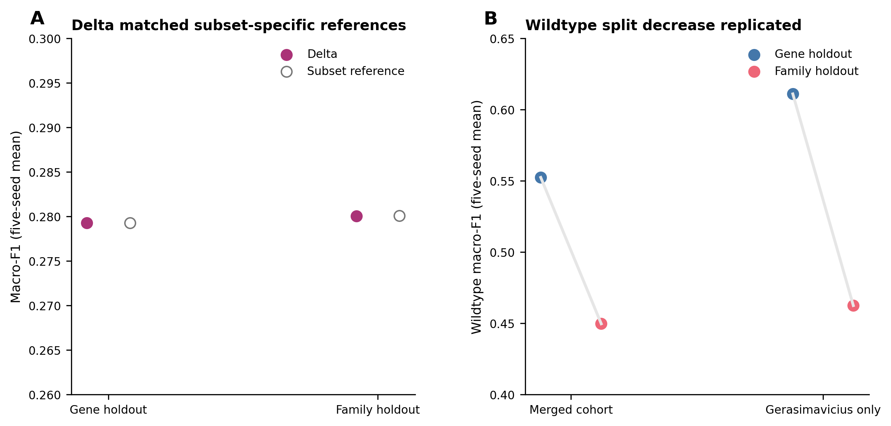
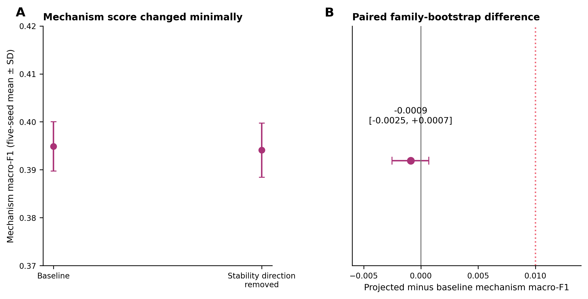

# Supplementary material for "Dissecting protein identity, mutation effects, and disease mechanism in ESM-2 embeddings"

## Supplementary methods

### ClinVar pathogenicity cohort audit trail

Records came from the ClinVar GRCh38 `variant_summary` file retrieved on 19 August 2026 and last
modified on 17 August 2026.

Repeated ClinVar records encoding the same gene, protein position, wildtype residue, and mutant
residue were collapsed into one row, removing 1,219 duplicate records while retaining their ClinVar
identifiers. One substitution with conflicting pathogenic and benign labels was excluded. After
sampling at most 20 variants per class per gene with seed 42, 96 genes containing only one class
were excluded. The balanced intermediate cohort contained 25,740 variants across 1,837 genes, with
12,870 variants per class. Sequence application removed 1,063 variants. Restoring per-gene balance
removed another 293 variants and 22 genes, producing the final cohort of 24,384 variants across
1,802 genes.

### Probe configurations

The preregistered mechanism probe used training-fold PCA with at most 256 components followed by
logistic regression (`C=1.0`, `lbfgs`, 1,000 maximum iterations), without standardization or class
weighting. The exploratory multiclass logistic probe standardized within each training fold and
used balanced class weights and 2,000 maximum iterations. Mechanism and enzyme MLPs had hidden
layers of 256 and 64 ReLU units, minority-class oversampling, an L2 penalty of 0.0001, 500 maximum
iterations, and early stopping with a 15% validation fraction and patience of 10 iterations.

The pathogenicity logistic probe used fold-standardized inputs, `C=1.0`, and 1,000 maximum
iterations. Its MLP had one 256-unit hidden layer and 300 maximum iterations, with early stopping on
a group-disjoint 10% validation subset of each outer training fold. The stability MLP had hidden
layers of 256 and 64 ReLU units with dropout 0.2 and used Adam with learning rate 0.001, weight decay
0.001, batches of 2,048, 60 maximum epochs, and patience of 15. The exploratory random forest used
100 trees. XGBoost used 300 trees, depth 6, learning rate 0.1, row and feature subsampling of 0.8,
and histogram tree construction.

### Additional provenance

Analysis outputs recorded the Git commit, input fingerprints, parameters, and software versions.
Embedding arrays and cohorts were checked against stored fingerprints; environment snapshots and
logs were retained.

## Supplementary figures

Supplementary Figure S1. Single-source mechanism robustness analysis. (A) Five-seed mean macro-F1
from the mutation delta on the Gerasimavicius-only subset under gene and Pfam-family holdout. Open
points show the majority-class references recomputed for the subset. (B) Five-seed mean wildtype
macro-F1 under gene and family holdout in the merged mechanism cohort and the Gerasimavicius-only
subset. The gene-to-family decrease was reproduced in the single-source analysis.

Supplementary Figure S2. Stability-direction removal from the mechanism representation. (A)
Five-seed mean mechanism macro-F1 before and after removing the fitted stability direction; bars
show standard deviations across seeds. The mechanism classifier used the exploratory
full-dimensional, standardized, class-balanced specification. (B) Paired projected-minus-baseline
macro-F1 with its 95% family-bootstrap confidence interval. The dotted line marks the registered
+0.01 threshold.
