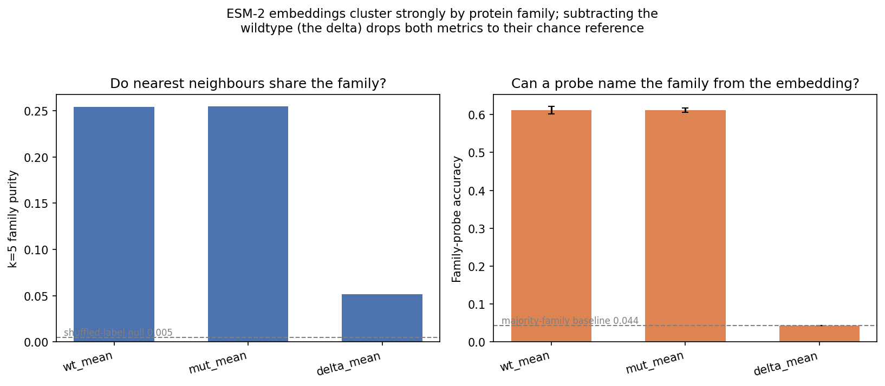

# Does ESM-2 Encode Disease Mechanism?

## Abstract

Protein language models (pLMs) encode rich sequence information, but it is not clear what biological signal their variant representations actually carry. This work characterises what ESM-2's mutation-induced embedding shift (the delta) does and does not encode, across 17,826 missense variants in 1,935 disease genes.

The short answer: the delta encodes pathogenicity but not mechanism. Under rigorous family-split cross-validation, a linear probe on the delta classifies GOF/DN/LOF at the chance floor (macro-F1 ≈ 0.29). The apparent above-chance signal in standard gene-split evaluation comes from protein family recognition, not the mutation. A positive control confirms the pipeline is sound — the same delta predicts ClinVar pathogenicity at AUROC 0.89 with no family-split drop. Within-family tests, where family identity cannot be a shortcut, show no recoverable mechanism signal. Scaling to ESM-3 1.4B raises the mechanism floor modestly (0.38 → 0.44); structure tokens add little beyond sequence. Decomposing the pathogenicity delta reveals it is essentially conservation: the model's own masked log-likelihood at the variant position matches or beats the full 1,280-d embedding, and the embedding adds nothing on top.

---

## 1. Background

### What is ESM-2?

ESM-2 is a protein language model trained on hundreds of millions of protein sequences. Like a language model trained on text, it learns to predict missing amino acids from context — and in doing so, it builds up internal representations that capture something about protein biology: evolutionary conservation, structural propensity, functional site identity.

The output of ESM-2 is an **embedding** — a vector of 1,280 numbers for each residue in the protein. These numbers encode the model's representation of that position in context. For a given variant, we compute two embeddings: one for the wildtype (normal) sequence and one for the mutant. The difference — the **delta** — captures how the mutation shifts the model's internal representation of the protein.

### The mechanism classification problem

When a missense variant causes disease, it does so through one of three main mechanisms:

- **Gain-of-function (GOF)** — the mutant protein does too much. It may be constitutively active, resistant to normal inhibition, or acquire a new activity. GOF variants often act dominantly: a single mutant copy is enough to cause disease.
- **Dominant negative (DN)** — the mutant protein actively interferes with the normal copy. It may form a dysfunctional complex with the wildtype protein and poison it. DN variants also act dominantly.
- **Loss-of-function (LOF)** — the mutant protein does too little or nothing. It may be unstable, misfolded, or unable to bind its substrate. LOF variants often require both copies to be disrupted (recessive), though haploinsufficiency — where losing one copy is enough — is also common.

Knowing the mechanism matters clinically. A GOF variant might respond to an inhibitor; a LOF variant might not. A DN variant can be dominant even when the gene is not haploinsufficient. Current variant interpretation tools (e.g. AlphaMissense, CADD) predict pathogenicity — whether a variant is damaging — but not mechanism — how it acts. These are different questions.

### The dataset

We use a merged dataset combining two sources. **Gerasimavicius et al. 2022** (*Nature Communications*) — a curated set of 10,233 missense variants across 948 disease genes, each labelled with a gene-level mechanism class (GOF, DN, or one of two LOF subtypes: haploinsufficient HI and autosomal recessive AR). Labels are derived from clinical genetics literature and ClinVar curation. This is the primary source of mechanism labels. **Gene2Phenotype (G2P)** — a database of gene-disease associations maintained by clinical genetics groups. We use the `molecular mechanism` field to assign mechanism labels to an additional set of genes not covered by Gerasimavicius.

After merging and filtering to variants with available UniProt sequences, the working dataset contains 17,826 variants across 1,935 genes spanning 1,134 Pfam protein families. Class distribution: GOF = 2,682 / DN = 1,550 / LOF = 13,594. LOF is the dominant class (76%), reflecting the general prevalence of loss-of-function disease genetics.

### Evaluation design and shared glossary

The core question is whether the shift in ESM-2's representation of a protein caused by a missense variant (the delta embedding) carries information about whether that variant acts through GOF, DN, or LOF. ESM-2 was not trained on mechanism labels — it was trained to predict masked amino acids. Any mechanism signal would have to emerge implicitly from sequence patterns that correlate with mechanism. There are reasons to think this might work (GOF variants may concentrate in activation domains; DN variants may cluster at interfaces), and reasons to think it might not (mechanism labels are gene-level, not variant-level, which is a fundamental mismatch with what ESM-2 encodes).

The following terms recur throughout the report and are defined here once:

**Features.**

| Name | Dimensionality | Notes |
|---|---|---|
| `wt_only_mean` | 1280-d vector | ESM-2's embedding of the original protein (mean-pooled over residues) |
| `mut_only_mean` | 1280-d vector | ESM-2's embedding of the mutant protein (mean-pooled over residues) |
| `wt_concat_mut` | 2560-d vector | The two embeddings above concatenated |
| `delta_mean` | 1280-d vector | Mutant embedding minus original (`mut_only_mean − wt_only_mean`) |
| `delta_per_residue` | 1280-d vector | Same delta, but at the single mutated position instead of mean-pooled |
| `onehot_aa` | 40-d vector | Amino-acid substitution identity (1-hot WT + 1-hot mutant), no sequence context |
| `foldx_ddg` | scalar | Physics-based protein-stability change estimate, ΔΔG in kcal/mol |
| `alphamissense` | scalar | DeepMind's pathogenicity score (reference predictor) |

**Cross-validation schemes.** **Gene-split** holds out whole genes from training: no single gene appears in both train and test, but related genes may be split across the two. Proteins fall into families that share sequence, structure, and frequently mechanism, so a model can classify a held-out gene on the basis of family resemblance rather than the mutation. This is the standard default partition but is leakage-prone for the present question. **Family-split** holds out whole Pfam families: the model is evaluated only on proteins dissimilar to those seen in training, and family resemblance is no longer available as a shortcut. The difference between the two quantifies the contribution of family recognition.

**Metrics.** **Macro-F1** is the mean per-class F1 over GOF/DN/LOF, so rare classes count equally with common ones. The chance floor for macro-F1 is **0.288**, the measured majority-class score from a `DummyClassifier` under the same 5-seed gene/family-split CV; this is the bar features must clear to carry signal. **AUROC** is reported one-vs-rest per class, with a chance value of 0.50. All values are means across 5 random seeds unless noted; seed-to-seed standard deviation is small (≤0.03 on macro-F1), so the ordering is stable.

**Probes.** Linear probes are logistic regression; nonlinear probes are MLPs (256→64, dropout 0.3, class-weighted cross-entropy, early stopping) unless otherwise stated.

---

## 2. Mechanism classification

Mechanism can be predicted from ESM-2 above chance (family-split macro-F1 ≈ 0.44 vs the 0.29 floor), but the predictive signal is the protein's own embedding — its identity and family — rather than the embedding change induced by the mutation (the delta), which was the quantity under test. Because mechanism labels are gene-level, protein family correlates with mechanism, so the model is largely exploiting family identity as a proxy rather than learning mechanism from the mutation itself.

### Table 1 — Gene-split (leakage-prone)

| Feature | Macro_f1 | AUROC GOF | AUROC DN | AUROC LOF |
|---|---:|---:|---:|---:|
| wt_only_mean | 0.545 | 0.807 | 0.732 | 0.838 |
| mut_only_mean | 0.547 | 0.809 | 0.732 | 0.838 |
| wt_concat_mut | 0.555 | 0.806 | 0.721 | 0.831 |
| delta_mean | 0.288 | 0.609 | 0.542 | 0.594 |
| delta_per_residue | 0.315 | 0.595 | 0.585 | 0.597 |
| onehot_aa | 0.288 | 0.542 | 0.553 | 0.547 |
| foldx_ddg | 0.279 | 0.619 | 0.589 | 0.629 |
| alphamissense | 0.288 | 0.602 | 0.640 | 0.634 |
| *naive baseline* | *0.288* | *0.500* | *0.500* | *0.500* |

### Table 2 — Family-split (homology-controlled)

| Feature | Macro_f1 | AUROC GOF | AUROC DN | AUROC LOF |
|---|---:|---:|---:|---:|
| wt_only_mean | 0.442 | 0.730 | 0.717 | 0.791 |
| mut_only_mean | 0.443 | 0.732 | 0.716 | 0.791 |
| wt_concat_mut | 0.451 | 0.715 | 0.700 | 0.776 |
| delta_mean | 0.288 | 0.560 | 0.514 | 0.546 |
| delta_per_residue | 0.305 | 0.567 | 0.569 | 0.554 |
| onehot_aa | 0.288 | 0.542 | 0.545 | 0.543 |
| foldx_ddg | 0.279 | 0.617 | 0.595 | 0.623 |
| alphamissense | 0.290 | 0.589 | 0.637 | 0.626 |
| *naive baseline* | *0.288* | *0.500* | *0.500* | *0.500* |

The naive baseline is a majority-class classifier (always predicts LOF) measured under the same 5-seed CV. Its macro-F1 of 0.288 is the value that `delta_mean`, `onehot_aa`, `foldx_ddg`, and `alphamissense` match — those features are performing at the majority-class baseline.

*Figure 1. Gene-split mechanism macro-F1 by feature (5-seed mean ± std). The dashed line is the measured majority-class floor (0.288). Only the wildtype, mutant, and concatenated embeddings clear it; the mutation-only features sit on the floor.*

*Figure 2. Gene-split (blue) versus family-split (orange) macro-F1 per feature. The annotated drop on the three absolute-embedding features is the part of the gene-split score attributable to family recognition; the floor-level features have no above-chance signal to lose.*

*Figure 3. One-vs-rest AUROC per mechanism class (5-seed mean ± std). Left: `wt_only` is above the 0.50 chance line for GOF, DN, and LOF, and every class falls under family-split. Right: `delta_mean` sits near chance on both splits.*

*Figure 4. The same per-class AUROC as a slopegraph: each line connects a class's gene-split score (left) to its family-split score (right). For `wt_only` (solid) every class falls when whole families are held out — the size of the drop is the family-recognition component. For `delta_mean` (dashed) the lines sit just above the 0.50 chance reference and barely move.*

### Reading the tables

**1. The delta carries no linear signal.** In Table 2, `delta_mean` scores macro-F1 = 0.288. Given only the mutation-induced embedding change, the linear classifier separates GOF/DN/LOF at the chance level. This is the family-split result, so the value is not attributable to leakage.

**2. Family recognition in the gene-split scores.** `wt_only_mean` scores 0.545 on gene-split but 0.442 on family-split. The feature performs at 0.55 when other variants from the same gene may appear in training, and drops by roughly a fifth on unfamiliar families. The difference reflects family recognition rather than mechanism.

**3. A reference pathogenicity predictor also fails.** On gene-split, `alphamissense` scores 0.288 — the chance floor for mechanism classification. The limitation is not specific to ESM-2 but reflects the difficulty of recovering mechanism from these signals.

**4. Loss-of-function is the most separable class.** On gene-split, `wt_only_mean` reaches AUROC 0.838 for LOF versus 0.732 for DN. The feature discriminates loss-of-function variants more readily than dominant-negative ones, consistent with loss-of-function being a more directly encoded property than the interaction-dependent dominant-negative mechanism.

**5. The physics-based stability estimate is weak.** On family-split, `foldx_ddg` reaches AUROC 0.623 for LOF. The FoldX destabilization estimate is above chance but limited, and is the highest value any single feature attains for mechanism under family-split.

**6. A nonlinear model recovers part of the delta signal.** On gene-split, the nonlinear models on `delta_mean` score macro-F1 ≈ 0.40 (kNN 0.408, MLP 0.399) versus 0.288 for the linear probe. A nonlinear model raises the delta from the chance floor (0.29) to about 0.40, indicating a faint signal not accessible to a linear model — though this analysis cannot say whether that signal is mechanism or residual protein/family structure the subtraction did not fully remove. The family-split MLP value is lower (0.380). Full nonlinear table below.

**7. Per-residue delta vs mean-pooled delta.** On gene-split, `delta_per_residue` scores 0.315 versus 0.288 for `delta_mean`. The embedding change at the mutated position scores marginally higher than the change averaged over the protein, a weak indication that local signal exceeds global, though both remain near the floor.

### Nonlinear probes on the delta

| Model (on `delta_mean`) | Gene-split macro_f1 | Family-split macro_f1 |
|---|---:|---:|
| MLP | 0.399 ± 0.009 | 0.380 ± 0.010 |
| kNN | 0.408 ± 0.008 | — |
| GBM (gradient-boosted trees) | 0.309 ± 0.004 | — |
| Random Forest | 0.298 ± 0.004 | — |

Family-split was computed for the MLP only; GBM/RF/kNN family-split were not run (—). Under family-split — the honest test — the MLP score (0.380) remains below the linear protein-embedding score (0.442); the nonlinear delta does not exceed the linear absolute embedding. The faint nonlinear lift on gene-split is most plausibly residual family structure the subtraction did not fully remove (quantified in Section 4).

### Interpretation

A single missense substitution shifts ESM-2's protein-level embedding only slightly, so `mut − wt` is dominated by per-variant variation rather than a consistent per-mechanism direction. There is also a granularity mismatch: mechanism labels are gene-level (every variant in a gene shares one label), whereas the delta is variant-level. A variant-level feature is poorly matched to a gene-level label, while the gene-level wildtype embedding is well matched to it. This is the most probable reason the protein embedding outperforms the delta.

### Statistical limitations

The seed-to-seed spread reflects fold reshuffling on fixed data, not sampling uncertainty. Planned before preprint submission: cluster-bootstrap confidence intervals over genes (effective N ≈ 1,935 genes, not 17,826 variants — and far smaller for the rare classes); a permutation test against the 0.288 floor for a p-value on "above chance" and on the gene-vs-family gap; AUPRC and PPV/NPV alongside AUROC; calibration curves.

---

## 3. Positive control: pathogenicity

A null result is only interpretable if the pipeline can recover signal that is known to exist. This section runs the identical embedding extraction, features, probes, and cross-validation on a task with an established answer: published ESM-2 work predicts ClinVar pathogenicity at AUROC 0.88–0.94 (e.g. Brandes et al. 2023). The variant set is balanced pathogenic/benign ClinVar missense variants in the merged mechanism gene set (≤20 per gene per class, GRCh38 assembly): 37,218 variants (18,815 pathogenic / 18,403 benign) across 1,929 genes, 5 seeds.

### Table 3 — Pathogenicity AUROC (5-seed mean ± std)

| Feature | Probe | Gene-split | Family-split | Leakage drop |
|---|---|---:|---:|---:|
| delta_mean | mlp | 0.897 ± 0.001 | 0.894 ± 0.001 | 0.003 |
| delta_mean | logreg | 0.862 ± 0.000 | 0.859 ± 0.001 | 0.003 |
| wt_only | mlp | 0.616 ± 0.003 | 0.605 ± 0.002 | 0.011 |
| wt_only | logreg | 0.575 ± 0.003 | 0.555 ± 0.003 | 0.020 |
| *no-skill baseline* | — | *0.500* | *0.500* | — |

The **leakage drop** is gene-split AUROC minus family-split AUROC. A drop near zero means the score survives without family hints (genuine per-variant signal); a large drop means the score was inflated by family recognition. Seed-to-seed standard deviation is ≤0.003 throughout.

*Figure 5. The same `delta_mean` feature on both tasks. Left: pathogenicity AUROC, where the delta reaches ~0.90 and barely moves under family-split. Right: mechanism macro-F1, where the delta sits on the measured chance floor (0.29). The wildtype embedding is shown alongside for contrast.*

### Reading the tables

**1. The delta predicts pathogenicity well.** On gene-split, `delta_mean` with an MLP reaches AUROC 0.897; the linear probe reaches 0.862. The mutation-induced embedding shift carries strong, largely linear information about whether a variant is damaging. This is the same `delta_mean` feature that scores at the chance floor for mechanism in Section 2.

**2. The signal is family-split-stable, so it is not leakage.** `delta_mean` MLP moves from 0.897 (gene-split) to 0.894 (family-split) — a drop of 0.003. Holding out whole protein families removes almost nothing, which means the prediction relies on per-variant biochemistry, not on recognising the protein family. This contrasts with the mechanism `wt_only` feature, which lost ~0.10 macro-F1 under family-split.

**3. The wildtype embedding cannot predict pathogenicity.** `wt_only` reaches only 0.616 (MLP) and 0.575 (logreg) on gene-split. The wildtype sequence alone does not indicate which hypothetical mutation would be damaging — as expected, because pathogenicity is a property of the specific mutation, not of the gene. This is the mirror image of the mechanism result, where `wt_only` outperformed the delta because mechanism labels are gene-level.

**4. Nonlinearity adds a modest, real margin.** For `delta_mean`, the MLP exceeds logistic regression by 0.035 (0.897 vs 0.862), well outside the ±0.001 seed noise. The pathogenicity signal is mostly linear, with a small additional nonlinear component.

### The dissociation

The same ESM-2 delta embedding, the same pipeline, two tasks:

| Task | Feature | Best AUROC / macro-F1 | Family-split stable? |
|---|---|---|---|
| pathogenicity (this section) | delta_mean MLP | AUROC 0.897 | yes (Δ 0.003) |
| mechanism (Section 2) | delta_mean MLP | macro-F1 ≈ 0.40 (near floor) | — |

ESM-2 delta embeddings predict whether a mutation is damaging at AUROC ~0.90 but do not classify how it acts above chance. The pipeline recovers known signal cleanly, so the mechanism null is a real property of the representation, not a pipeline failure. The pre-registered pass criterion (`delta_mean` MLP AUROC ≥ 0.85) is met.

### Statistical limitations

The seed spread reflects fold reshuffling, not sampling uncertainty. Planned before preprint submission: cluster-bootstrap confidence intervals over genes on each AUROC, and calibration curves.

---

## 4. Family clustering and the leakage account

Section 2 found that ESM-2 predicts mechanism above chance but the signal is the protein's family identity acting as a proxy rather than the mutation. This section measures that family clustering directly, turning Section 2's inference into a measured result. Of the 17,826 merged variants, 1,902 genes carry a Pfam annotation across 1,134 families (833 singletons).

Metrics are computed on the 1,069 genes in non-singleton families. The family probe uses the 757 genes in the 145 families with ≥3 members under stratified 3-fold CV. A z-score is the distance of the observed value from the shuffled-label null, in null standard deviations.

### Table 4 — Family clustering by embedding view

| View | k=5 purity (null, z) | k=10 purity (z) | Within/between ratio (z) | Family-probe acc (baseline) |
|---|---|---|---|---|
| wt_mean | 0.254 (0.005, z=+249) | 0.169 (z=+155) | 0.514 (z=−15.0) | 0.612 (0.044) |
| mut_mean | 0.255 (0.005, z=+244) | 0.168 (z=+156) | 0.513 (z=−15.1) | 0.612 (0.044) |
| delta_mean | 0.051 (0.005, z=+33) | 0.035 (z=+32) | 0.973 (z=−1.2) | 0.044 (0.044) |

The silhouette score is negative for every view (wt −0.161, delta −0.390) despite every other metric showing strong clustering. This is a known failure of silhouette with many singleton clusters, uneven cluster sizes, and high-dimensional embeddings — all present here. It is ignored in the interpretation; the other three metrics are consistent.

### Table 5 — Mechanism–family overlap

| Quantity | Value |
|---|---|
| Fraction of multi-gene-family genes whose mechanism matches their family's majority (leave-one-out) | 0.833 |
| Correlation between a gene's family-tightness and whether it matches its family majority (WT) | r = +0.001 (p = 0.98) |

The 83.3% fraction is measured over the 1,069 genes in non-singleton families: for each gene, the family majority is taken over its family-mates (excluding the gene itself), and the gene "matches" if its label equals that majority. It depends only on labels and families, not the embedding. The value is partly inflated by class imbalance — LOF is 76% of variants, so families skew LOF and "matching the majority" is easier than it would be for balanced classes.

*Figure 6. Two label-free family-recognition metrics across the three views. Left: k=5 family purity against the shuffled-label null (0.005). Right: linear family-probe accuracy against the majority-family baseline (0.044). The wildtype and mutant embeddings cluster strongly by family; the delta falls to the reference value in both panels.*

### Leakage fraction

The leakage fraction quantifies how much of a feature's gene-split mechanism score comes from family recognition rather than mechanism understanding. It is defined as (gene-split F1 − family-split F1) / (gene-split F1 − 0.288), where 0.288 is the chance floor.

| Feature | Gene-split | Family-split | Leakage fraction |
|---|---:|---:|---:|
| wt_only_mean | 0.545 | 0.442 | 40.1% |
| mut_only_mean | 0.547 | 0.443 | 40.3% |
| wt_concat_mut | 0.556 | 0.451 | 39.4% |
| delta_per_residue | 0.316 | 0.305 | 38.2% |
| delta_mean | 0.288 | 0.288 | undefined (at floor) |

About 40% of the absolute-embedding gene-split score is family recognition that disappears when whole families are held out. The delta features sit at or near the floor on both splits, so the fraction is undefined for `delta_mean` and small in absolute terms for `delta_per_residue`.

### Reading the tables

**1. WT embeddings cluster strongly by family.** For `wt_mean`, a gene's 5 nearest neighbours share its protein family 25.4% of the time versus 0.5% under label shuffling — about 50× chance, at z = +249. The within/between distance ratio of 0.514 means same-family genes sit about half as far apart as different-family genes. This is expected: ESM-2 was trained to capture evolutionary and functional relationships, and protein families are defined by exactly those. The point is not that it happens, but what it does to downstream evaluation.

**2. Family is directly readable from the embedding.** A linear probe identifies which of 145 families a gene belongs to with 61.2% accuracy versus a 4.4% majority-family baseline — roughly 14× the baseline. Family identity is not a subtle property of the embedding; it is one of its dominant axes.

**3. The mutant embedding behaves identically to the wildtype.** `mut_mean` matches `wt_mean` on every metric. A single missense substitution barely moves the protein-level embedding, so the mutant carries the same family signal as the wildtype and no distinct mutation information at the family level.

**4. The delta removes almost all family signal.** For `delta_mean`, k=5 purity drops to 0.051 and family-probe accuracy falls to 0.044 — exactly the majority baseline. Subtracting the wildtype cancels the family signal. A small residual remains in the purity metric (z = +33); this faint leftover is the most likely source of the small nonlinear delta lift seen in Section 2 (MLP ≈ 0.40 vs linear 0.29) — the MLP picking up residual family structure rather than learning mechanism.

**5. Family predicts mechanism for most genes.** 83.3% of genes in multi-gene families carry their family's majority mechanism label (leave-one-out). Combined with point 2, this is the leakage channel: family is readable from the WT embedding at 61%, and family implies mechanism for 83% of genes, so a "recognise the family, predict its usual mechanism" strategy reaches a high score without using the mutation.

**6. Tighter clustering does not predict which genes match their family.** The per-gene correlation between family-tightness and matching the family-majority mechanism is r = +0.001 (p = 0.98) for WT — no relationship. The family-recognition effect is population-level (families share mechanism on average); it does not mean the most tightly clustered genes are the most label-consistent.

### The causal chain

Three measured numbers connect embedding clustering to the Section 2 baseline:

1. Family is recoverable from the WT ESM-2 embedding at 61% accuracy (vs 4.4% baseline).
2. 83% of genes in multi-gene families carry their family's majority mechanism label.
3. Therefore a family-recognition classifier reaches a high mechanism score without learning mechanism — and Section 2's `wt_only` macro-F1 of 0.545 (gene-split) is a worked example. Its drop to 0.442 under family-split is the portion of that score that family recognition cannot reach once whole families are held out.

### Statistical limitations

This section is single-seed (seed 0); its shuffled-label nulls are the permutation framework the other sections will adopt. Planned before preprint: multi-seed the family-probe accuracy (≥5 seeds with a spread); cluster-bootstrap confidence intervals over families for the probe accuracy and k-NN purity metrics.

---

## 5. Within-family test

Sections 2 and 4 showed that ESM-2's above-chance mechanism score is largely family recognition, and that subtracting the wildtype removes almost all family signal. This section asks the natural follow-up: if family identity is held constant — so it cannot be the shortcut — is there any mechanism signal left to find?

For each protein family we run within-family gene-split CV: folds hold out whole genes, so no gene appears in both train and test. Two probes are run on each view — a linear logistic regression and an MLP — and every number is the mean ± std across 5 seeds. Per-family gene counts are tiny (6–33 genes), so single-seed numbers are dominated by which gene lands in which fold; the seed spread is the honest error bar. For each family we report the macro-F1 of always predicting that family's most common class (`majority_baseline_f1`). A feature only carries within-family signal if it beats this baseline — not merely if it beats the global 0.29 floor.

A family is kept if it has ≥6 genes and ≥2 classes, but within-family CV can still fail to produce a scorable fold when a minority class has a single gene. When no fold is scorable across all 5 seeds the cell is reported as blank rather than as a fabricated 0. This happened for 8 of the 28 families.

### Table 6 — Within-family macro-F1, delta vs wt_only (5-seed mean ± std)

Bold marks a delta cell that clears its base and has std < 0.10 (the bar for "stable, real-looking signal").

| Family | n genes | n var | logreg wt | logreg delta | mlp wt | mlp delta | base (majority F1) |
|---|---:|---:|---:|---:|---:|---:|---:|
| PF00046 | 33 | 179 | 0.347 ± 0.068 | 0.333 ± 0.054 | 0.408 ± 0.161 | 0.367 ± 0.064 | 0.316 |
| PF00069 | 23 | 192 | 0.538 ± 0.124 | 0.344 ± 0.024 | 0.505 ± 0.092 | 0.368 ± 0.058 | 0.234 |
| PF00520 | 15 | 1044 | 0.304 ± 0.032 | 0.256 ± 0.030 | 0.304 ± 0.044 | 0.299 ± 0.034 | 0.253 |
| PF00168 | 14 | 67 | 0.857 ± 0.118 | 0.493 ± 0.077 | 0.815 ± 0.094 | 0.575 ± 0.111 | 0.294 |
| PF00071 | 13 | 157 | 1.000 ± 0.000 | 0.755 ± 0.027 | 0.569 ± 0.152 | 0.626 ± 0.034 | 0.317 |
| PF00038 | 13 | 84 | 0.333 ± 0.033 | 0.313 ± 0.027 | 0.445 ± 0.131 | 0.266 ± 0.036 | 0.305 |
| PF00104 | 13 | 93 | 0.261 ± 0.057 | 0.408 ± 0.119 | 0.491 ± 0.266 | 0.443 ± 0.103 | 0.422 |
| PF00023 | 11 | 240 | 0.241 ± 0.082 | 0.451 ± 0.102 | 0.296 ± 0.087 | 0.415 ± 0.108 | 0.429 |
| PF00004 | 11 | 125 | 0.410 ± 0.024 | 0.221 ± 0.039 | 0.243 ± 0.271 | 0.210 ± 0.040 | 0.228 |
| PF01094 | 10 | 212 | 0.295 ± 0.069 | 0.236 ± 0.111 | 0.303 ± 0.052 | 0.152 ± 0.072 | 0.197 |
| PF02931 | 9 | 78 | 0.510 ± 0.171 | 0.236 ± 0.051 | 0.479 ± 0.150 | 0.224 ± 0.027 | 0.233 |
| PF00010 | 8 | 44 | 0.318 ± 0.105 | 0.407 ± 0.060 | 0.246 ± 0.166 | **0.565 ± 0.061** | 0.470 |
| PF00001 | 7 | 52 | 0.271 ± 0.108 | 0.246 ± 0.051 | 0.464 ± 0.279 | 0.383 ± 0.134 | 0.373 |
| PF01410 | 7 | 298 | 0.198 ± 0.066 | 0.393 ± 0.074 | 0.343 ± 0.198 | 0.365 ± 0.058 | 0.447 |
| PF13246 | 7 | 139 | 0.147 ± 0.147 | 0.481 ± 0.044 | 0.173 ± 0.120 | 0.449 ± 0.012 | 0.485 |
| PF00130 | 6 | 99 | 0.740 ± 0.260 | 0.394 ± 0.086 | 0.176 ± 0.104 | 0.394 ± 0.086 | 0.476 |
| PF00167 | 6 | 20 | 0.367 ± 0.033 | 0.367 ± 0.033 | 1.000 ± 0.000 | 0.333 ± 0.000 | 0.429 |
| PF00503 | 6 | 57 | 0.683 ± 0.448 | 0.315 ± 0.107 | 0.424 ± 0.414 | 0.367 ± 0.047 | 0.472 |
| PF00431 | 6 | 24 | 0.889 ± 0.111 | 0.571 ± 0.429 | 0.571 ± 0.429 | 0.325 ± 0.075 | 0.385 |
| PF07679 | 6 | 146 | 0.337 ± 0.132 | 0.365 ± 0.123 | 0.439 ± 0.300 | 0.361 ± 0.120 | 0.477 |

Eight further families (PF00096, PF00250, PF00041, PF00008, PF00106, PF07714, PF00076, PF12662) produced no scorable fold across all seeds and are omitted.

*Figure 7. Per-family delta (MLP) macro-F1 minus that family's own majority baseline, ordered by the gap (5-seed mean ± std). Bars to the right of zero exceed the family's baseline. The families are small (6–33 genes), so per-family scores are dominated by fold assignment; hatched families contain a mechanism class held by a single gene and have a degenerate score.*

### Reading the table

**1. In the largest, most balanced family, the delta is at the baseline.** PF00520 (ion channel) has the most data — 1,044 variants, all three classes. Its delta scores 0.256 and 0.299 against a 0.253 baseline. With the most data and no shortcut available, the mutation tells the classifier nothing.

**2. Where wt_only beats delta, it is family structure, not the mutation.** In PF00069 (kinase) wt_only reaches 0.538 while delta stays at 0.344, and in PF00168 it is 0.857 vs 0.493. The protein embedding scores higher in most families, but it is reading which gene this is relative to its family-mates — not what the mutation does. The delta, which isolates the mutation, does not share the lift.

**3. The high scores are degenerate or unstable.** PF00071 (Ras GTPase) shows wt_only = 1.000, but the family is almost all one class with a single odd gene out — an easy split, not real discrimination. The wildly swinging cells (PF00431, PF00503, PF00167, with std up to 0.45) are coin-flips on a handful of genes.

**4. No family clears the bar.** Only one delta cell beats its baseline and stays stable across seeds (PF00010), and that family has just 8 genes — one gene flipping moves it. Every other delta result is at baseline, below it, or too noisy to call. There is no family where the delta recovers mechanism.

### Interpretation

Within-family CV is the strongest available test for mechanism-in-the-mutation: it strips out the family-recognition shortcut that inflates the gene-split scores in Section 2. Under that test the delta is at chance. This tightens the central finding rather than complicating it — the small nonlinear delta lift seen cross-family (MLP ≈ 0.40 vs linear 0.29) does not reappear as a within-family mechanism signal, consistent with that lift being residual family structure the subtraction did not fully remove. The granularity mismatch applies here too: mechanism labels are gene-level, so within a family there are only a handful of labelled points (6–33 genes), and a variant-level delta is a poor match for a gene-level label measured on so few genes.

### Statistical limitations

Per-family sizes are 6–33 genes, so this table is descriptive, not inferential. Planned before preprint: Benjamini-Hochberg FDR control for the 28-family screen, or restate as exploratory; minimum-detectable-effect per family so nulls read as underpowered; cluster-bootstrap confidence intervals over genes within each family.

---

## 6. Scale and structure: ESM-3

This section asks whether a larger, structure-aware model closes the mechanism gap. ESM-3 (`esm3-sm-open-v1`, 1.4B open weights) is run on the same 17,826 merged variants under two conditions — sequence tokens alone, and sequence tokens plus AlphaFold2 structure tokens — to separate the effect of model scale from the effect of explicit structure. The representation is the same mutant-minus-wildtype shift used throughout, dimension 1536. Structure tokens, where used, come from AlphaFold2 coordinates encoded by ESM-3's own structure tokenizer; they are applied to both forward passes so the delta cancels everything except the substitution.

The matched ESM-2 floor is the 5-seed mean MLP delta_mean family-split macro-F1 from Section 2, **0.380**. The pass threshold is that floor plus 0.05, i.e. **0.430**.

**Pre-registered decision rules:**

| Gate | Criterion | Reads as |
|---|---|---|
| M1 | `seq_struct` family-split F1 > 0.430 | does ESM-3-with-structure beat ESM-2? |
| M2 | `seq` family-split F1 > 0.430 | does scale alone beat ESM-2? |
| M3 | `seq_struct` − `seq` > 0.030 | does structure add signal beyond scale? |

### Table 7 — Mechanism macro-F1 (MLP, 5-seed mean ± std)

| Condition | Gene-split | Family-split |
|---|---|---|
| ESM-2 650M delta_mean (Section 2) | — | 0.380 |
| ESM-3 seq | 0.445 ± 0.023 | 0.438 ± 0.009 |
| ESM-3 seq_struct | 0.448 ± 0.015 | 0.453 ± 0.012 |

### Table 8 — Per-class AUROC and logistic regression (family-split, 5-seed mean)

| Condition | GOF AUROC | DN AUROC | LR macro-F1 |
|---|---|---|---|
| ESM-3 seq | 0.689 | 0.647 | 0.429 ± 0.003 |
| ESM-3 seq_struct | 0.699 | 0.628 | 0.439 ± 0.005 |

### Table 9 — Decision rules

| Gate | Criterion | Value | Verdict |
|---|---|---|---|
| M1 | `seq_struct` family-split F1 > 0.430 | 0.453 | pass |
| M2 | `seq` family-split F1 > 0.430 | 0.438 | pass |
| M3 | `seq_struct` − `seq` > 0.030 | 0.014 | fail |

### Reading the tables

**1. Scale lifts the family-split floor.** ESM-3 sequence-only reaches a family-split macro-F1 of 0.438, above the matched ESM-2 delta floor of 0.380 and clear of the 0.430 threshold. Because the variants, labels, splits, probe, and seeds are all held fixed, the only thing that changed is the embedding model, so this lift is attributable to scale. M2 passes. The margin is thin: 0.438 clears the 0.430 threshold by 0.008 — about one seed of spread — and the lift over ESM-2 is a modest 0.058, so the difference is reported here as consistent in direction but not yet tested for significance.

**2. Structure tokens add a little, but not enough to count.** Sequence-plus-structure reaches 0.453, edging out sequence-only by 0.014. M1 passes (0.453 above 0.430), so ESM-3-with-structure also beats ESM-2 — but M3 fails: the seq_struct − seq gap of 0.014 is below the 0.030 bar pre-registered for calling structure a distinct ingredient. The gain is real and consistent (seq_struct is higher than seq on family-split MLP, GOF AUROC, and LR), but small. The verdict is: scale suffices.

**3. The lift is not leakage.** For sequence-only the gene-split and family-split scores are almost identical (0.445 vs 0.438), so holding out whole families costs almost nothing. The improvement over ESM-2 holds up on the leakage-free split rather than evaporating when families are removed, so it reflects family-transferable signal, not gene-identity leakage.

**4. The number is up, but not useful.** 0.45 macro-F1 on three classes is above the chance floor but well below what mechanism prediction would need to be relied on. The DN AUROC sits near 0.63–0.65 and GOF near 0.69, so most of the separability is GOF-versus-rest rather than a clean three-way resolution. Scale moved the floor; it did not solve the task.

### What this is and is not

This is not a test of function tokens. ESM-3's third modality is not exposed by the open-weights API and was dropped. The conclusion is limited to sequence and sequence-plus-structure. It is not a claim that structure is irrelevant to mechanism in general — only that ESM-3's AlphaFold2 structure tokens, added to its sequence tokens, do not add enough to this delta-based probe to clear the pre-registered bar. This echoes Section 7's finding that the family-transferable signal these models carry is conservation-like rather than structural, so structure that is itself conservation-correlated supplies little that is new. Structure tokens were applied to 94.5% of variants (16,852 of 17,826); the remaining 5.5% fell back to sequence-only.

### Statistical limitations

The seed-std bars reflect fold reshuffling on a fixed set of genes, not sampling uncertainty. The headline is a 0.058 family-split lift over ESM-2, and M2 clears its 0.430 threshold by only 0.008. Planned before preprint: a paired cluster bootstrap over genes on the shared variant set for the `seq` − ESM-2 delta gap (and `seq_struct` − `seq`), so "ESM-3 beats ESM-2" and "structure adds nothing" rest on tested gaps rather than separated error bars; cluster-bootstrap CIs over genes; permutation test against the 0.288 floor; calibration.

---

## 7. The shape of the pathogenicity signal

Section 3 showed the ESM-2 delta predicts ClinVar pathogenicity at AUROC ≈ 0.90 while classifying mechanism at chance. This section asks what that pathogenicity signal actually is — where in the delta it lives, whether it is one direction or many, whether it transfers across protein families, and what biological quantity it corresponds to.

A mutation moves ESM-2's representation of a protein from one point in its 1,280-dimensional space to another. That movement has a size (magnitude, `‖d‖`) and a heading (direction, `d/‖d‖`). The pathogenicity signal is almost entirely in the heading: direction-only predicts pathogenicity as well as the full delta (family-split AUROC 0.90), while magnitude-only is weak (0.67). That direction is a single axis — one fitted direction recovers all of the linear signal — and it is family-universal: a direction fit on one set of protein families transfers to held-out families (AUROC 0.85). It is not explained by context-free substitution chemistry (R² = 0.07). What it is is conservation: ESM-2's own masked log-likelihood at the variant position predicts pathogenicity at AUROC 0.891, above the 1,280-d embedding delta (0.859), and adding the embedding to conservation gains +0.002. Mechanism does not ride on any comparably transferable direction.

The delta `d = mut_emb − wt_emb` has a size (**magnitude** `‖d‖`) and a heading (**direction** `d/‖d‖`). For each variant the delta is split into:

| Feature | What it is |
|---|---|
| `full` | the delta itself (1,280-d) |
| `magnitude` | `‖d‖`, a single scalar — how much the representation was disturbed |
| `direction` | `d/‖d‖`, the unit vector — which way it was disturbed |

Each is run through the same probes (logreg, MLP) under family-split CV. Pathogenicity (37,218 ClinVar variants, 1,929 genes) and mechanism (17,826 merged variants, 1,935 genes) are both tested. Four follow-up probes then characterise the pathogenicity direction: its rank, its cross-family transfer, whether it is context-free biochemistry, and whether it is conservation.

### Table 10 — Magnitude vs direction (family-split)

| Feature | Pathogenicity AUROC (logreg / MLP) | Mechanism macro-F1 (MLP) |
|---|---|---|
| full delta | 0.859 / 0.893 | 0.415 ± 0.004 |
| magnitude `‖d‖` | 0.673 / 0.673 | 0.322 ± 0.011 |
| direction `d/‖d‖` | 0.867 / **0.901** | 0.415 ± 0.006 |
| chance floor | 0.500 | 0.288 ± 0.002 |

Pathogenicity std ≤ 0.003 throughout.

### Table 11 — Geometry of the pathogenicity direction

| Quantity | Value |
|---|---|
| full linear AUROC (family-split) | 0.859 ± 0.006 |
| 1-D projection onto the single fitted direction | 0.859 ± 0.006 |
| AUROC after removing 1 / 2 / 5 directions and refitting | 0.859 / 0.858 / 0.845 |
| cosine of directions fit on disjoint family-halves | 0.322 ± 0.021 |
| cosine null (labels shuffled) | −0.006 ± 0.036 |
| transfer AUROC (direction fit on half A, scored on B) | **0.848 ± 0.004** |

### Table 12 — Cross-family transfer, by task and probe

| Task | Probe | Pooled AUROC | Transfer AUROC |
|---|---|---|---|
| pathogenicity (path vs benign) | linear | 0.867 | 0.848 |
| pathogenicity | GBM | 0.905 | **0.896** |
| mechanism (GOF vs rest) | linear | 0.799 | 0.625 |
| mechanism | GBM | 0.802 | 0.640 |

Stability (ΔΔG transfer) was not run — the S1724 megascale embeddings are not present in this run.

### Table 13 — What is the direction?

| Test | Value | Reading |
|---|---|---|
| R²(axis ← context-free biochemistry, Ridge) | 0.074 | axis is not substitution chemistry |
| pathogenicity AUROC, context-free biochem only | 0.694 | well below the delta |
| pathogenicity AUROC, ESM-2 delta only | 0.860 | |
| conservation alone (4 masked-LL features) | **0.891 ± 0.007** | beats the delta |
| masked_marginal alone (1 feature) | 0.891 ± 0.007 | one number suffices |
| embedding delta (1,280-d) | 0.859 ± 0.006 | |
| conservation + delta | 0.893 ± 0.007 | delta adds +0.002 |
| Spearman(axis projection, masked_marginal) | +0.741 | axis ≈ conservation |

Two thresholds summarise this: conservation alone clears 0.85 (0.891), and adding the embedding to conservation moves the AUROC by less than 0.02 (+0.002). Together they say the axis is conservation and the embedding adds nothing on top of it.

### Reading the tables

**1. Pathogenicity is a heading, not a distance.** In Table 10, direction-only reaches MLP AUROC 0.901 — equal to the full delta (0.893) — while magnitude-only is stuck at 0.673. The raw size of the perturbation barely matters; essentially all the pathogenicity signal is in which way the representation shifts. The natural prior guess — that a more damaging mutation simply moves the embedding further — does not hold: distance is weak, heading is everything.

**2. That heading is a single axis.** In Table 11, one fitted direction recovers the entire linear signal. Removing that direction and refitting does not collapse the score — it drifts down only slightly (0.859 → 0.845 after five removals). So pathogenicity is one functional degree of freedom, redundantly spread across many correlated coordinates rather than concentrated in any single one.

**3. The axis is family-universal.** Directions fit on disjoint family-halves have low raw cosine (0.322) yet transfer almost perfectly (0.848 vs the within-set 0.859). The low cosine is a red herring: because the signal is redundantly encoded, each fit picks a different mix of correlated features that point at the same predictive subspace. Transfer AUROC is the metric that matters, and it says the axis is genuinely shared across families.

**4. It is not context-free chemistry.** In Table 13, a regression of the axis on BLOSUM / hydropathy / charge / volume explains only 7% of it, and those features alone reach just 0.694 AUROC versus the delta's 0.860. The axis is position-aware, not a lookup on the amino-acid swap.

**5. The axis is conservation — and the embedding adds nothing.** This is the decider. The model's own masked log-likelihood at the variant position — four numbers, or even the single ESM1v masked-marginal — reaches 0.891, above the 1,280-d embedding delta (0.859). Adding the embedding to conservation moves the score by +0.002 (K2 fails), and the axis correlates +0.74 with the masked-marginal. So the embedding direction carries no pathogenicity information beyond what the model's likelihood head already exposes.

**6. Mechanism does not ride on a transferable direction.** In Table 12, pathogenicity transfers across families (0.85–0.90) while mechanism transfers far worse (0.62–0.64), and decomposing the mechanism delta (Table 10) surfaces no hidden signal — direction and full are identical (0.415). The contrast is the point: within one frozen model, pathogenicity is a transferable linear axis and mechanism is not.

### Interpretation

Pathogenicity behaves as an angular property of ESM-2's perturbation space — what kind of disruption a mutation causes, not how large — and that angle is a single, family-universal direction. The decisive finding is what the direction turns out to be: conservation. ESM-2's mean-pooled embedding delta is, for pathogenicity, a worse and redundant re-encoding of the model's own masked-LM likelihood (0.859 vs 0.891). Pooling the embedding loses information the likelihood head exposes directly. This reframes the pathogenicity result as characterisation — the delta predicts pathogenicity because it partially reflects conservation — rather than a claim that the representation holds anything novel about damage beyond likelihood. Transferability is task-dependent within one frozen model: pathogenicity rides on a shared conservation axis that crosses family boundaries; mechanism has no comparably transferable direction.

### What this is and is not

- Not a claim that ESM-2 cannot represent pathogenicity — it predicts it at AUROC 0.90. The claim is narrower: the mean-pooled embedding delta adds nothing over the model's masked-LM likelihood for this task.
- Not a mechanism result. Mechanism is included as a contrast: it stays well below pathogenicity and does not transfer across families. The direction decomposition surfaces no hidden mechanism signal (direction = full = 0.415).
- Stability (ΔΔG direction transfer) was not run — the S1724 megascale embeddings are not cached in this run.
- The biochemistry probe's R² (0.074) is an in-sample description of the axis, not a held-out generalisation estimate.

### Statistical limitations

The seed spreads are tight (pathogenicity AUROC std ≤ 0.007), but a seed only reshuffles the CV folds on a fixed set of genes. Planned before preprint: cluster-bootstrap CIs over genes (effective N ≈ 1,929 genes, not 37,218 variants) on each AUROC; paired difference test for the two load-bearing gaps — conservation (0.891) versus the embedding delta (0.859), and the conservation-plus-delta increment (+0.002, the basis for K2) — via a paired cluster bootstrap over genes; calibration. This section already uses a shuffled-label null (the cosine null in Table 11) and pre-registered gates.

---

## Statistical limitations and planned analyses

Each section above carries a section-specific statistical-limitations subsection identifying its weakest inferential point. The full plan is in `STATS_PLAN.md`. The shared limitation across sections is that the seed-to-seed spreads reflect fold reshuffling on a fixed set of genes, not sampling uncertainty: every seed reuses all the data, so the spread understates the true error.

Two analyses are priorities before bioRxiv submission, both CPU-only and runnable on existing result files:

1. **Cluster-bootstrap confidence intervals over genes.** Mechanism and pathogenicity labels are gene-level, so the effective N is ≈ 1,935 genes (mechanism) or ≈ 1,929 genes (pathogenicity), not 17,826 / 37,218 variants — and far smaller for the rare mechanism classes (DN ≈ 9%, GOF ≈ 15%). Cluster-bootstrap CIs over genes replace the seed-std bars across every macro-F1 and AUROC.
2. **Label-permutation tests.** A permutation null against the 0.288 mechanism floor gives a p-value on "above chance" and on the gene-split versus family-split gap; the same machinery yields p-values for the paired ESM-3 versus ESM-2 lift and the conservation-plus-delta increment.

Everything else — AUPRC and prevalence-conditional PPV/NPV alongside AUROC; FDR control for the 28-family within-family screen (Section 5); minimum-detectable-effect per family for the within-family nulls; and calibration curves for every probe — is planned for journal revision rather than the preprint.

---

## What I would do next

The strongest single constraint on this analysis is that **mechanism labels are gene-level, not variant-level**. Every variant within a gene shares one mechanism label, while the quantity under test — the delta — is variant-level. Variants within a gene differ in mechanism (a kinase has both GOF and LOF missense variants), but they share a label here. Variant-level ground-truth mechanism labels would change the analysis qualitatively, both by aligning the label granularity with the feature, and by removing the family-via-gene proxy that drives most of the gene-split signal. Curating even a few hundred variant-level labels from functional assays would be a more informative next experiment than another probe.

The second priority is **ESM-3's function tokens**. The third ESM-3 modality was not tested because the open-weights API does not expose it. Function tokens condition on protein function annotations, and of the three modalities they are the most plausible pathway to mechanism signal: GOF/DN/LOF distinctions are function-level rather than structure-level, and the structure-token result in Section 6 already suggests that what is missing from sequence is not 3D geometry.

The third is **end-to-end fine-tuning**. Frozen probes are the right characterisation tool — they tell you what the representation already contains — but fine-tuning ESM-2 (or ESM-3) directly on mechanism labels is the natural next step, with appropriate regularisation to prevent overfitting on 1,935 gene labels (early stopping on family-split, strong weight decay, and possibly LoRA over the top few layers).

The fourth, more speculative, is to test **the conservation finding as a hypothesis**. If pathogenicity ≈ conservation in ESM-2's delta, then mechanism differences might be detectable in a conservation-residualised space — variants that are equally likely to be deleterious but differ in how. The decomposition would project the delta onto the conservation axis and ask whether the residual carries mechanism. That is untested.

Finally, the two priority **statistical analyses** noted above (cluster-bootstrap CIs over genes, label-permutation tests) should be added before the preprint is submitted. Both run on existing result files.

---

## Provenance

| Section | Script | Result file |
|---|---|---|
| 2 — Mechanism classification | `experiments/mechanism/classify_by_mechanism`; `experiments/mechanism/mlp`; `experiments/mechanism/naive_baseline.py` | `results/run6/family_split_baselines_seed{0..4}.json`, `aggregate.json`, `nonlinear_results_seed{0..4}.json`, `naive_baseline.json` |
| 3 — Pathogenicity control | `experiments/pathogenicity/pathogenicity_control.py` | `results/run6/pathogenicity_control_seed{0..4}.json`, `pathogenicity_control.json` |
| 4 — Family clustering | `experiments/mechanism/family_clustering.py` | `results/run6/family_clustering.json` |
| 5 — Within-family | `experiments/mechanism/mechanism_within_family.py` | `results/run6/within_family_mechanism.json` |
| 6 — ESM-3 scale and structure | `experiments/esm3/esm3_mechanism.py` (`--dataset merged`) | `results/run6/esm3_mechanism/merged/summary.json` |
| 7 — Geometry | `experiments/geometry/run_geometry.py`; `experiments/geometry/conservation_axis.py` | `results/run6/magnitude_direction/{probe_results,geometry_results,transfer_contrast,probe4_axis_identity,conservation_axis}.json` |

All sections are run 6. ESM-2 model: `esm2_t33_650M_UR50D`. ESM-3 model: `esm3-sm-open-v1` (1.4B, open weights). Embeddings verified before analysis; variant indices row-aligned across feature arrays. Full run log: `RUN_PROGRESS.md`, Run 6.
