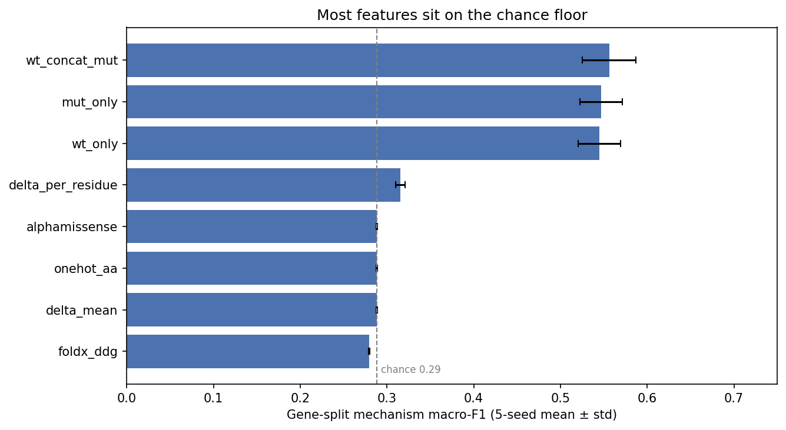
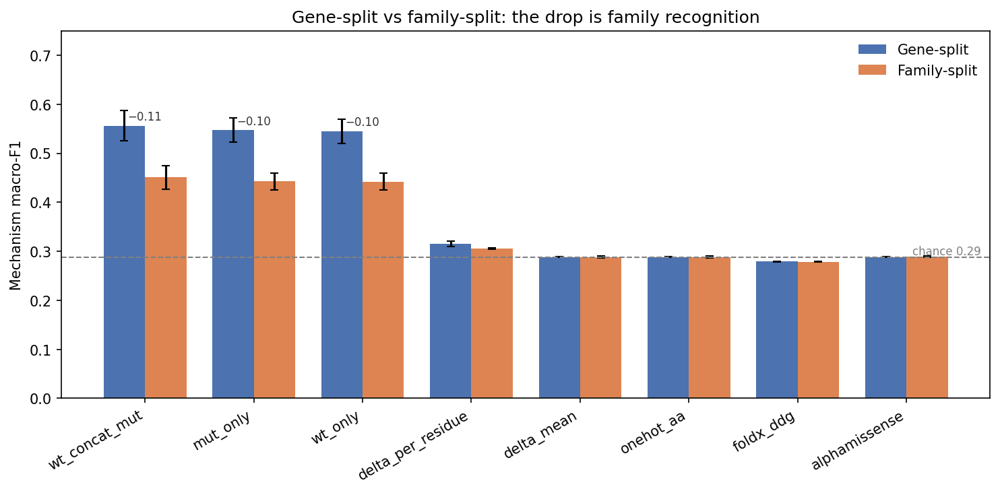
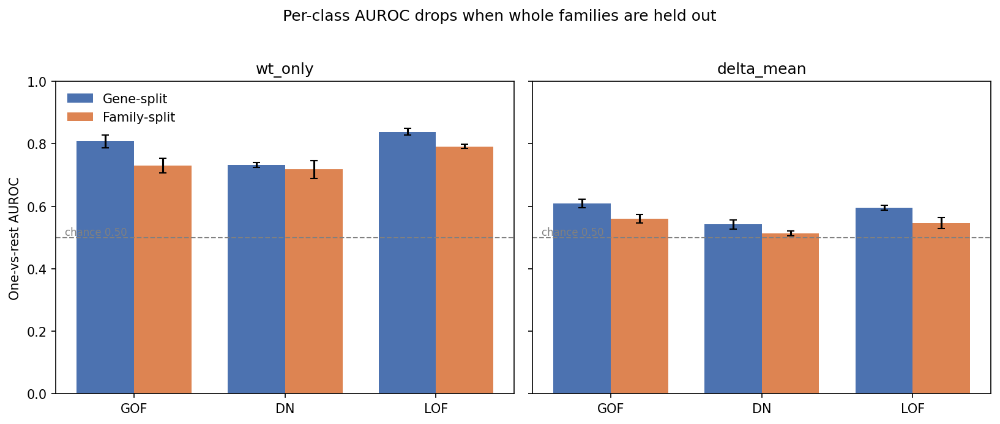
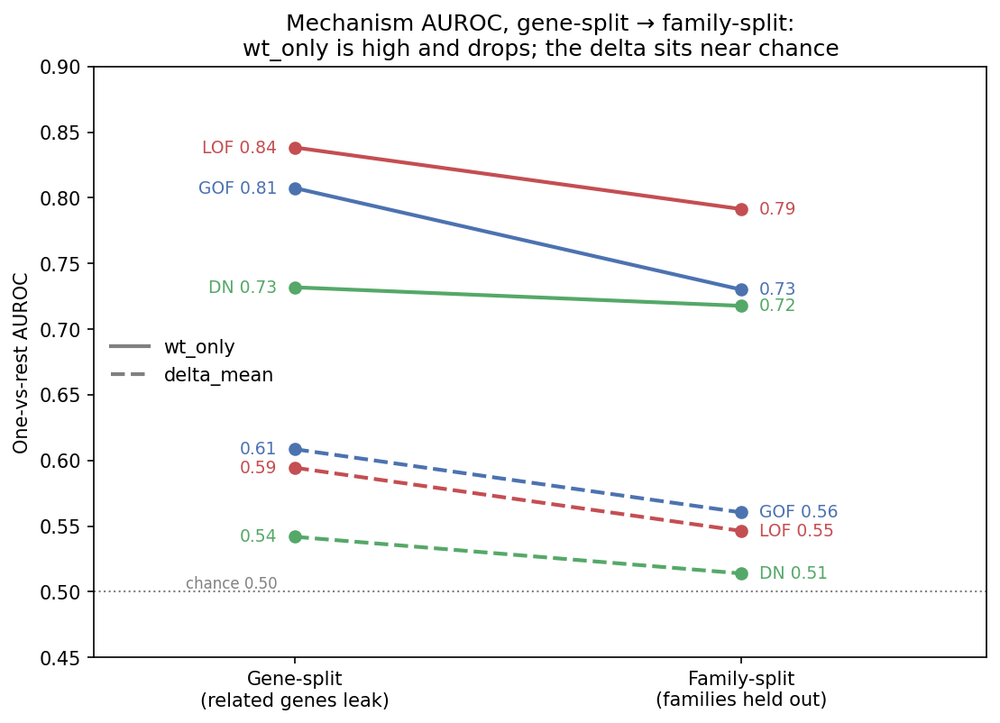

# Results: Does ESM-2 Encode Disease Mechanism?

*Companion to [`INTRO_REPORT.md`](INTRO_REPORT.md), which explains the biology, the
dataset, and why this question matters.*

**Run 6 · 2026-05-30** · ESM-2 `esm2_t33_650M_UR50D` · 17,826 variants · 1,935 genes ·
1,134 protein families · classes LOF 76% / GOF 15% / DN 9%. Results in
[`results/run6/`](../../results/run6/).

---

## Summary

Mechanism can be predicted from ESM-2 above chance (family-split macro_f1 ≈ 0.44 vs the 0.29
floor), but the predictive signal is the protein's own embedding — its identity and family —
rather than the embedding change induced by the mutation (the delta), which was the quantity
under test. Because mechanism labels are gene-level, protein family correlates with mechanism
(kinases are enriched for gain-of-function, structural proteins for dominant-negative), so the
model is largely exploiting family identity as a proxy rather than learning mechanism from the
mutation itself.

---

## Glossary

Table Labels

**Rows - Features:**

| Name | Dimensionality | Notes |
|---|---|---|
| `wt_only_mean` | 1280-d vector | ESM-2's embedding of the original protein (mean-pooled over residues) |
| `mut_only_mean` | 1280-d vector | ESM-2's embedding of the mutant protein (mean-pooled over residues) |
| `wt_concat_mut` | 2560-d vector | The two embeddings above concatenated |
| `delta_mean` | 1280-d vector | Mutant embedding minus original (`mut_only_mean − wt_only_mean`) |
| `delta_per_residue` | 1280-d vector | Same delta, but at the single mutated position instead of mean-pooled |
| `onehot_aa` | 40-d vector | Amino-acid substitution identity |
| `foldx_ddg` | scalar | Physics-based protein-stability change estimate |
| `alphamissense` | scalar | DeepMind's pathogenicity score (reference predictor) |

`foldx_ddg` : The predicted change in folding free energy, ΔΔG = ΔG(mutant) − ΔG(wildtype),
in kcal/mol: positive values indicate the mutation destabilizes the fold, negative values
indicate it stabilizes the fold, and values near zero indicate little thermodynamic effect.
Values are the precomputed monomer ΔΔG (`raw_FoldX_Monomer`) from the Gerasimavicius et al.
source dataset.  

`onehot_aa` : No language model; encodes only the substitution (one-hot of wildtype residue + one-hot of mutant residue, 40-d), with no position or structural context. E.g. Alanine → Valine.

**Columns — Metrics:**

| Metric | The question it answers | Range | Baseline/Naive value |
|---|---|---|---|
| `macro_f1` | Per-class F1 averaged equally across the 3 classes (rare classes weighted as much as common). | 0–1 | ~0.29 |
| `AUROC GOF` | Can it separate gain-of-function from everything else? | 0.5–1 | 0.50 |
| `AUROC DN` | Can it separate dominant-negative from everything else? | 0.5–1 | 0.50 |
| `AUROC LOF` | Can it separate loss-of-function from everything else? | 0.5–1 | 0.50 |

The baseline/naive value("knows-nothing") is the score a classifier obtains when it has learned no
discriminative signal; it is the threshold separating informative features from
uninformative ones. For `macro_f1` it is 0.288, measured from a majority-class
`DummyClassifier` (it is not 0 because of the class imbalance). For AUROC it is 0.50. Both are
shown as the `naive baseline` row in the tables below.

Each AUROC is computed one-vs-rest — the class in question against the other two combined —
so it is a binary discrimination, and its chance value is 0.50 regardless of the number of
classes. (The 1/3 figure for guessing one of three classes applies to multiclass accuracy, a
different metric not reported here.)

**Two tables, two cross-validation setups:**

A model is trained on one subset of variants and evaluated on a disjoint subset. How the
train/test partition is defined is material, because proteins are related to one another and
that relatedness can permit a model to exploit shortcuts.

- **Gene-split** — the partition is defined over genes: no single gene appears in both train
  and test, but related genes may be split across the two. Proteins fall into families (e.g.
  kinases, collagens) that share sequence, structure, and, frequently, mechanism: kinases are
  enriched for gain-of-function and structural proteins for dominant-negative. If gene A is in
  the training set and a close relative gene B is in the test set, a model can classify B
  correctly on the basis of family resemblance rather than the mutation, which inflates the
  apparent score. This is the standard default partition but is leakage-prone for the present
  question.

- **Family-split** — the partition is defined over whole families: an entire family is held
  out, so the model is evaluated only on proteins dissimilar to those seen in training, and
  family resemblance is no longer available as a shortcut. This is the appropriate test of
  whether a feature generalizes to previously unseen proteins.

The difference between the two tables quantifies the contribution of family recognition.
Where a feature scores higher on gene-split than on family-split, the difference is the
portion of its gene-split performance attributable to family recognition rather than
mechanism. A feature carrying genuine mechanism signal would score similarly under both.

All values are means across 5 random seeds; the seed-to-seed standard deviation is small
(≤0.03 on `macro_f1`), so the ordering is stable.

---

## Table 1 — Gene-split (leakage-prone)

| feature | macro_f1 | AUROC GOF | AUROC DN | AUROC LOF |
|---|---:|---:|---:|---:|
| wt_only_mean | 0.545 | 0.807 | 0.732 | 0.838 |
| mut_only_mean | 0.547 | 0.809 | 0.732 | 0.838 |
| wt_concat_mut | 0.555 | 0.806 | 0.721 | 0.831 |
| delta_mean | 0.288 | 0.609 | 0.542 | 0.594 |
| delta_per_residue | 0.315 | 0.595 | 0.585 | 0.597 |
| onehot_aa | 0.288 | 0.542 | 0.553 | 0.547 |
| foldx_ddg | 0.279 | 0.619 | 0.589 | 0.629 |
| alphamissense | 0.288 | 0.602 | 0.640 | 0.634 |
| *naive baseline* | *0.288* | *0.500* | *0.500* | *0.500* |

## Table 2 — Family-split (homology-controlled)

| feature | macro_f1 | AUROC GOF | AUROC DN | AUROC LOF |
|---|---:|---:|---:|---:|
| wt_only_mean | 0.442 | 0.730 | 0.717 | 0.791 |
| mut_only_mean | 0.443 | 0.732 | 0.716 | 0.791 |
| wt_concat_mut | 0.451 | 0.715 | 0.700 | 0.776 |
| delta_mean | 0.288 | 0.560 | 0.514 | 0.546 |
| delta_per_residue | 0.305 | 0.567 | 0.569 | 0.554 |
| onehot_aa | 0.288 | 0.542 | 0.545 | 0.543 |
| foldx_ddg | 0.279 | 0.617 | 0.595 | 0.623 |
| alphamissense | 0.290 | 0.589 | 0.637 | 0.626 |
| *naive baseline* | *0.288* | *0.500* | *0.500* | *0.500* |

The naive baseline is a majority-class classifier (always predicts LOF), measured with a
`DummyClassifier` under the same 5-seed cross-validation. Its macro_f1 of 0.288 is the value
that `delta_mean`, `onehot_aa`, `foldx_ddg`, and `alphamissense` match — those features are
performing at the majority-class baseline. (A frequency-weighted random classifier scores a
slightly higher 0.329, as occasional correct GOF/DN predictions raise their per-class F1; the
majority-class value is reported here as the stricter reference.)

*Gene-split mechanism macro-F1 by feature (5-seed mean ± std). The dashed line is the measured majority-class floor (0.288). Only the wildtype, mutant, and concatenated embeddings clear it; the mutation-only features sit on the floor.*

*Gene-split (blue) versus family-split (orange) macro-F1 per feature. The annotated drop on the three absolute-embedding features is the part of the gene-split score attributable to family recognition; the floor-level features have no above-chance signal to lose.*

*One-vs-rest AUROC per mechanism class (5-seed mean ± std). Left: `wt_only` is above the 0.50 chance line for GOF, DN, and LOF, and every class falls under family-split. Right: `delta_mean` sits near chance on both splits. This is the per-class view behind the macro-F1 figures above.*

*The same per-class AUROC as a slopegraph: each line connects a class's gene-split score (left) to its family-split score (right). For `wt_only` (solid) every class falls when whole families are held out — the size of the drop is the family-recognition component. For `delta_mean` (dashed) the lines sit just above the 0.50 chance reference and barely move.*

---

## Reading the tables

Each point below reads one cell (or pair of cells) from the tables above and states its
interpretation.

**1. The delta carries no linear signal.**
In the family-split table, `delta_mean` scores macro_f1 = 0.288. Given only the
mutation-induced embedding change, the classifier separates GOF/DN/LOF at the chance level.
This is the family-split result, so the value is not attributable to leakage.

**2. Family recognition in the gene-split scores.**
`wt_only_mean` scores macro_f1 = 0.545 on gene-split but 0.442 on family-split. The feature
performs at 0.55 when other variants from the same gene may appear in training, and drops by
roughly a fifth on unfamiliar families. The difference reflects family recognition rather
than mechanism.

**3. A reference pathogenicity predictor also fails.**
On gene-split, `alphamissense` scores macro_f1 = 0.288 — the chance floor for mechanism
classification. The limitation is not specific to ESM-2 but reflects the difficulty of
recovering mechanism from these signals.

**4. Loss-of-function is the most separable class.**
On gene-split, `wt_only_mean` reaches AUROC 0.838 for LOF versus 0.732 for DN. The feature
discriminates loss-of-function variants more readily than dominant-negative ones, consistent
with loss-of-function being a more directly encoded property than the interaction-dependent
dominant-negative mechanism.

**5. The physics-based stability estimate is weak.**
On family-split, `foldx_ddg` reaches AUROC 0.623 for LOF. The FoldX destabilization estimate
is above chance but limited, and is the highest value any single feature attains for
mechanism under family-split.

**6. A nonlinear model recovers part of the delta signal.**
On gene-split, the nonlinear models on `delta_mean` score macro_f1 ≈ 0.40 (kNN 0.408, MLP
0.399, comparable within noise; 5-seed means, nonlinear results) versus 0.288 for the linear
probe. A nonlinear model raises the delta from the chance floor (0.29) to about 0.40,
indicating a faint signal in the delta not accessible to a linear model — though this
analysis cannot say whether that signal is mechanism or residual protein/family structure
the subtraction did not fully remove. For the MLP — the only model run under family-split —
the value is lower there (0.380). Full nonlinear table below.

**7. Per-residue delta vs mean-pooled delta.**
On gene-split, `delta_per_residue` scores macro_f1 = 0.315 versus 0.288 for `delta_mean`. The
embedding change at the mutated position scores marginally higher than the change averaged
over the protein, a weak indication that local signal exceeds global, though both remain near
the floor.

---

## Nonlinear probes on the delta

A linear probe recovers only signal that is linearly separable. An MLP can capture
nonlinear structure, so the relevant question is whether a nonlinear model recovers signal
in the delta that the linear probe does not.

Values are means ± standard deviation across 5 seeds.

| model (on `delta_mean`) | gene-split macro_f1 | family-split macro_f1 |
|---|---:|---:|
| MLP | 0.399 ± 0.009 | 0.380 ± 0.010 |
| kNN | 0.408 ± 0.008 | — |
| GBM (gradient-boosted trees) | 0.309 ± 0.004 | — |
| Random Forest | 0.298 ± 0.004 | — |

Family-split was computed for the MLP only; GBM/RF/kNN family-split were not run (—).

On gene-split, the nonlinear models raise the delta from the 0.29 floor to about 0.40 — kNN
(0.408) and the MLP (0.399) are comparable and within seed noise of each other, while the
tree models (GBM 0.309, RF 0.298) are lower. This indicates the delta contains weak,
nonlinear structure not accessible to a linear probe; this analysis does not establish
whether that structure is mechanism or residual protein/family signal. Under family-split —
the honest test, computed here for the MLP only — the score is 0.38, which remains below the
linear protein-embedding score (0.44); the nonlinear delta does not exceed the linear
absolute embedding. Seed-to-seed standard deviation is small (≤0.013), so these values are
stable.

---

## Summary of findings

| Question | Finding |
|---|---|
| Can mechanism be predicted from ESM-2 above chance? | Yes — family-split macro_f1 ≈ 0.44 vs the 0.29 floor — but see the next row for why. |
| What is the 0.44 actually using? | Protein/family identity, not the mutation. Family correlates with mechanism (kinases→GOF, structural→DN) because labels are gene-level, so identity acts as a proxy rather than mechanism understanding. |
| Is the signal in the delta (the mutation's effect)? | Not linearly (chance level); only weakly under a nonlinear model. |
| Does AlphaMissense help? | No — at the floor; mechanism is a separate axis from pathogenicity. |
| How much do gene-split scores overstate performance? | Approximately 0.10 macro_f1 of homology leakage. |

---

## Interpretation

A single missense substitution shifts ESM-2's protein-level embedding only slightly, so
`mut − wt` is dominated by per-variant variation rather than a consistent per-mechanism
direction. There is also a granularity mismatch: mechanism labels are gene-level (every
variant in a gene shares one label), whereas the delta is variant-level. A variant-level
feature is poorly matched to a gene-level label, while the gene-level wildtype embedding is
well matched to it. This is the most probable reason the protein embedding outperforms the
delta.

---

## Limitations

- The nonlinear results are reported over 5 seeds for the MLP delta probes; the tree and kNN
  variants and the per-residue delta are likewise 5-seed means.
- A single ESM-2 size (650M) was tested; a larger model or a site-restricted delta might
  carry more signal.

## Statistical limitations and planned analyses (pre-preprint)

The seed-to-seed spread reflects fold reshuffling on fixed data, not sampling uncertainty.
Planned before preprint submission, not yet in the result files:

- **Confidence intervals** from a cluster bootstrap over genes (labels are gene-level, so the
  effective N is ≈ 1,935 genes, not 17,826 variants), replacing the seed-std bars.
- **Permutation test** against the 0.288 floor for a p-value on "above chance" and on the
  gene-vs-family gap.
- **Imbalanced-class metrics:** AUPRC and PPV/NPV at prevalence alongside AUROC.
- **Calibration:** the probes are uncalibrated; scores are discrimination only, not risks.

## Provenance

Embeddings verified before analysis (clean exit; all four arrays `(17826, 1280)`;
variant index row-aligned, length 17,826). AlphaMissense coverage 17,733 / 17,826 (99.5%).

Sources:
- Linear baselines (Tables 1–2, feature rows): `experiments/mechanism/classify_by_mechanism`, 5 seeds → `results/run6/family_split_baselines_seed{0..4}.json`, `aggregate.json`.
- Nonlinear results: `experiments/mechanism/mlp`, 5 seeds → `results/run6/nonlinear_results_seed{0..4}.json`.
- Naive baseline row (0.288 / 0.50): `experiments/mechanism/naive_baseline.py`, a majority-class `DummyClassifier` run under the same labels and 5-seed gene/family-split CV as the feature rows → `results/run6/naive_baseline.json`.

Full log: [`RUN_PROGRESS.md`](../../RUN_PROGRESS.md), Run 6.
