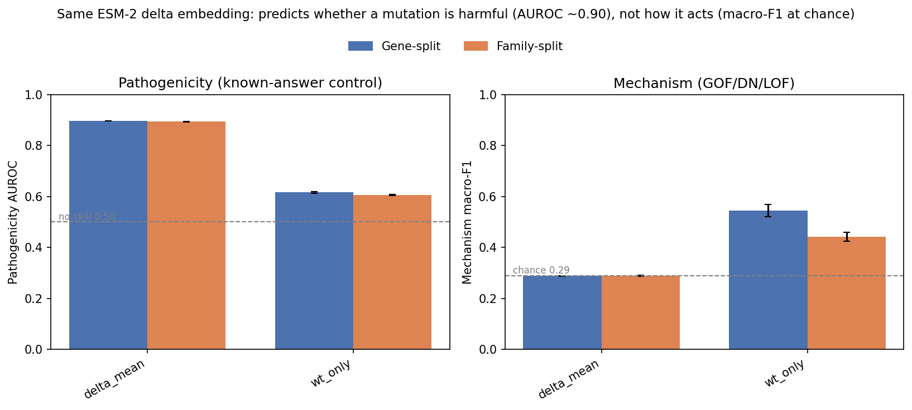

# Results: Can the Same ESM-2 Delta Predict Pathogenicity?

*Companion to [`report_classifier.md`](report_classifier.md) and
[`report_protein_family.md`](report_protein_family.md). The classifier report found that
ESM-2 delta embeddings classify mechanism (GOF/DN/LOF) at the chance floor. This report is
the positive control: it runs the same delta embeddings on a task where the answer is known —
ClinVar pathogenic-vs-benign — to test whether the mechanism null reflects a real absence of
signal or a broken pipeline.*

**Run 6 · 2026-05-31** · ESM-2 `esm2_t33_650M_UR50D` · 37,218 variants (18,815 pathogenic /
18,403 benign) · 1,929 genes · 5 seeds. Results in
[`results/run6/pathogenicity_control.json`](../../results/run6/pathogenicity_control.json).

---

## Summary
The same ESM-2 delta embeddings that score at chance on mechanism were run on a task with a known answer: telling ClinVar pathogenic and benign variants apart, drawn from the same disease genes, through the identical pipeline and probes. They succeed. The mutant-minus-wildtype delta predicts pathogenicity well (AUROC 0.90), and the score barely changes when whole protein families are held out, so the prediction reads the mutation itself rather than recognising the protein. The wildtype embedding alone, carrying no mutation information, stays near a coin flip. Two things follow. First, the pipeline recovers signal that is known to exist, so the earlier mechanism null is a real absence rather than a broken setup. Second, ESM-2's delta captures whether a mutation is harmful but not how it acts.

---

## What is measured, and why

The classifier report reported that ESM-2 delta embeddings classify mechanism at the chance
floor. A null result is only interpretable if the pipeline can recover signal that is known to
exist. This control runs the identical embedding extraction, features, probes, and
cross-validation on a task with an established answer: published ESM-2 work predicts ClinVar
pathogenicity at AUROC 0.88–0.94 (e.g. Brandes et al. 2023).

- If pathogenicity prediction succeeds, the pipeline is sound and the mechanism null is a real
  absence of mechanism signal.
- If pathogenicity prediction also fails, the pipeline is broken and the mechanism null is
  uninterpretable.

The variant set is balanced pathogenic/benign ClinVar missense variants in the merged
mechanism gene set (Gerasimavicius + G2P; ≤20 per gene per class, GRCh38 assembly). ESM-2
mean-pooled WT and mutant embeddings
are extracted, and binary probes are run on two features under two cross-validation schemes,
averaged over 5 seeds.

**Features:**

| Name | Dimensionality | Notes |
|---|---|---|
| `delta_mean` | 1280-d vector | Mutant embedding minus wildtype (`mut_only_mean − wt_only_mean`) — the mutation-induced shift |
| `wt_only` | 1280-d vector | ESM-2 embedding of the wildtype protein (mean-pooled); contains no mutation information |

**Probes and metric:**

| Item | Meaning | "No signal" value |
|---|---|---|
| logreg | Linear probe (logistic regression) | — |
| mlp | Nonlinear probe (MLP, 256 hidden units) | — |
| AUROC | Probability the probe ranks a random pathogenic variant above a random benign one | 0.50 |

**Cross-validation** is the same two schemes as the classifier report: gene-split (test genes
held out, related genes may appear in training) and family-split (whole Pfam families held
out). For a per-variant property like pathogenicity, a real signal should be stable across the
two; a large drop would indicate family-mediated leakage.

---

## Table 1 — Pathogenicity AUROC (5-seed mean ± std)

| Feature | Probe | Gene-split | Family-split | Leakage drop |
|---|---|---:|---:|---:|
| delta_mean | mlp | 0.897 ± 0.001 | 0.894 ± 0.001 | 0.003 |
| delta_mean | logreg | 0.862 ± 0.000 | 0.859 ± 0.001 | 0.003 |
| wt_only | mlp | 0.616 ± 0.003 | 0.605 ± 0.002 | 0.011 |
| wt_only | logreg | 0.575 ± 0.003 | 0.555 ± 0.003 | 0.020 |
| *no-skill baseline* | — | *0.500* | *0.500* | — |

**Leakage drop** is the gene-split AUROC minus the family-split AUROC. It measures how much of
a feature's score depends on recognising the protein family rather than the variant itself:
gene-split lets related genes appear in both train and test, while family-split holds out whole
families. A drop near zero means the score survives without family hints (genuine per-variant
signal); a large drop means the score was inflated by family recognition (homology leakage).

Seed-to-seed standard deviation is ≤0.003 throughout, so the values are stable. The no-skill
baseline for AUROC is 0.50 by definition (a classifier with no signal ranks pathogenic and
benign variants at chance); unlike macro-F1 it does not depend on class balance.

*The same `delta_mean` feature on both tasks. Left: pathogenicity AUROC, where the delta reaches ~0.90 and barely moves under family-split. Right: mechanism macro-F1, where the delta sits on the measured chance floor (0.29). The wildtype embedding is shown alongside for contrast. The mechanism panel uses results from [`report_classifier.md`](report_classifier.md).*

---

## Reading the tables

**1. The delta predicts pathogenicity well.**
On gene-split, `delta_mean` with an MLP reaches AUROC 0.897; the linear probe reaches 0.862.
The mutation-induced embedding shift carries strong, largely linear information about whether a
variant is damaging. This is the same `delta_mean` feature that scores at the chance floor for
mechanism in the classifier report.

**2. The signal is family-split-stable, so it is not leakage.**
`delta_mean` MLP moves from 0.897 (gene-split) to 0.894 (family-split) — a drop of 0.003.
Holding out whole protein families removes almost nothing, which means the prediction relies on
per-variant biochemistry, not on recognising the protein family. This contrasts with the
mechanism WT-only feature, which lost ~0.10 macro-F1 under family-split (report_classifier).

**3. The wildtype embedding cannot predict pathogenicity.**
`wt_only` reaches only 0.616 (MLP) and 0.575 (logreg) on gene-split. The wildtype sequence
alone does not indicate which hypothetical mutation in that protein would be damaging — as
expected, because pathogenicity is a property of the specific mutation, not of the gene. This
is the mirror image of the mechanism result, where `wt_only` outperformed the delta because
mechanism labels are gene-level.

**4. Nonlinearity adds a modest, real margin.**
For `delta_mean`, the MLP exceeds logistic regression by 0.035 (0.897 vs 0.862), well outside
the ±0.001 seed noise. The pathogenicity signal is mostly linear, with a small additional
nonlinear component.

---

## The dissociation

The same ESM-2 delta embedding, the same pipeline, two tasks:

| Task | Feature | Best AUROC / macro-F1 | Family-split stable? |
|---|---|---|---|
| pathogenicity (this report) | delta_mean MLP | AUROC 0.897 | yes (Δ 0.003) |
| mechanism (report_classifier) | delta_mean MLP | macro-F1 ≈ 0.40 (near floor) | — |

ESM-2 delta embeddings predict *whether* a mutation is damaging at AUROC ~0.90 but do not
classify *how* it acts above chance. The pipeline recovers known signal cleanly, so the
mechanism null is a real property of the representation, not a pipeline failure. The model
appears to detect damaging mutations — plausibly through conservation and local sequence
context — but not the functional axis that separates gain-of-function from loss-of-function.

---

## What this is and is not

- **Not a new finding that PLMs predict pathogenicity not mechanism.** This is stated
  qualitatively in prior work (e.g. AlphaMissense, LoGoFunc, PreMode). The contribution here is
  the controlled side-by-side measurement on one dataset, model, and pipeline.
- **Not a claim that mechanism is unlearnable from sequence** — only that ESM-2's delta
  representation, evaluated this way, does not reveal it, while it does reveal pathogenicity.
- **Pass criterion met:** `delta_mean` MLP AUROC ≥ 0.85 (pre-registered threshold for the
  pipeline to be considered sound).

---

## Statistical limitations and planned analyses (pre-preprint)

The seed spread reflects fold reshuffling, not sampling uncertainty. Planned before preprint
submission, not yet in the result files:

- **Confidence intervals** from a cluster bootstrap over genes on each AUROC (classes are
  balanced here, but the dependency structure still applies).
- **Calibration:** the probes are discrimination only, not calibrated risk estimates.

---

## Provenance

Computed by `experiments/pathogenicity/pathogenicity_control.py` (consolidated fetch → embed →
probe). ClinVar `variant_summary.txt.gz` filtered to GRCh38 missense, balanced pathogenic/benign
(≤20 per gene per class) → 38,698 variants; 37,218 embedded after WT/mut-window filtering. ESM-2
650M mean-pooled embeddings on RunPod H200. Probes: 5 seeds, logreg + MLP × {delta_mean,
wt_only} × {gene-split, family-split}, written per seed to
`results/run6/pathogenicity_control_seed{0..4}.json` and aggregated to
[`pathogenicity_control.json`](../../results/run6/pathogenicity_control.json). Full run log:
[`RUN_PROGRESS.md`](../../RUN_PROGRESS.md), Run 6, row 15.
