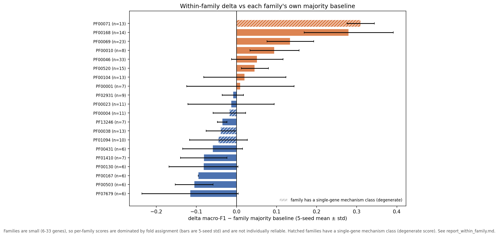

# Results: Can ESM-2 Distinguish Mechanism *Within* a Protein Family?

*Companion to [`report_classifier.md`](report_classifier.md) and
[`report_protein_family.md`](report_protein_family.md). Those reports showed that ESM-2's
above-chance mechanism score is largely family recognition, and that subtracting the wildtype
(the delta) removes almost all family signal. This report asks the natural follow-up: if family
identity is held constant — so it cannot be the shortcut — is there any mechanism signal left
to find?*

**Run 6 · 2026-05-31** · ESM-2 `esm2_t33_650M_UR50D` · 28 qualifying Pfam families ·
5 seeds × 5-fold within-family gene-split CV. Results in
[`results/run6/within_family_mechanism.json`](../../results/run6/within_family_mechanism.json).

---

## Summary

We looked at the signal within each family separately. For a given protein family, the family-recognition shortcut is removed, so any score above the per-family baseline is a candidate for genuine within-family mechanism signal. We find almost none. Across the 28 families large enough to test, the delta (mutation-induced) embedding sits at or near the per-family majority baseline in nearly every family. The `wt_only` embedding scores higher in most families, but that is the same family-identity effect operating within a family, not mechanism read from the mutation. No family shows a delta result that is both clearly above baseline and stable across seeds once degenerate cases are set aside — a within-family null for the delta, matching the cross-family null.

---

## What is measured, and why

Each gene carries one gene-level mechanism label (GOF/DN/LOF). Within a single protein family,
all genes share the family, so a classifier cannot win by recognising the family — it must use
something else. We restrict to one family at a time and ask whether mechanism is recoverable
from two embedding views:

| View | What it is |
|---|---|
| `wt_only` | ESM-2 embedding of the wildtype protein, mean-pooled (one vector per variant) |
| `delta` | mutant minus wildtype (the mutation-induced shift) |

For each family we run **within-family gene-split Cross-Validation**: folds hold out whole genes, so no gene
appears in both train and test. Two probes are run on each view — a linear logistic regression
and an MLP — and every number is the mean ± std across **5 seeds** (the fold assignment is
reshuffled per seed). Per-family gene counts are tiny (6–33 genes), so single-seed numbers are
dominated by which gene lands in which fold; the seed spread is the honest error bar.

**Baseline.** For each family we report the macro-F1 of always predicting that family's most
common class (`majority_baseline_f1`). A feature only carries within-family signal if it beats
this baseline — not merely if it beats the global 0.29 floor, because a family skewed toward one
class has a higher floor of its own.

**Why some cells are blank.** A family is kept if it has ≥6 genes and ≥2 classes, but within-
family CV can still fail to produce a scorable fold — a minority class with a single gene is
either absent from training (the probe can't learn it) or absent from test (it can't be scored),
and with only 6–8 genes a fold can end up single-class. When no fold is scorable across all 5
seeds the cell is reported as blank rather than as a fabricated 0. This happened for 8 of the 28
families; it is a property of the sample sizes, not a result.

---

## Table 1 — Within-family macro-F1, delta vs wt_only (mean ± std over 5 seeds)

Families with at least one scorable probe, ordered by gene count. Each probe column is a macro-F1
(0–1, higher is better) as mean ± std over 5 seeds. The last column, **base (majority F1)**, is
the score from ignoring ESM-2 and always predicting the family's most common mechanism — the bar
every probe must beat to show real within-family signal. A probe only carries mechanism signal if
it sits clearly above the `base` *in its own row*. Bold marks a delta cell that clears its base
and has std < 0.10 (the bar for "stable, real-looking signal").

| Family | n genes | n var | logreg wt | logreg delta | mlp wt | mlp delta | base (majority F1) |
|---|---:|---:|---:|---:|---:|---:|---:|
| PF00046 | 33 | 179 | 0.347 ± 0.068 | 0.333 ± 0.054 | 0.408 ± 0.161 | 0.367 ± 0.064 | 0.316 |
| PF00069 | 23 | 192 | 0.538 ± 0.124 | 0.344 ± 0.024 | 0.505 ± 0.092 | 0.368 ± 0.058 | 0.234 |
| PF00520 | 15 | 1044 | 0.304 ± 0.032 | 0.256 ± 0.030 | 0.304 ± 0.044 | 0.299 ± 0.034 | 0.253 |
| PF00168 | 14 | 67 | 0.857 ± 0.118 | 0.493 ± 0.077 | 0.815 ± 0.094 | 0.575 ± 0.111 | 0.294 |
| PF00071 | 13 | 157 | 1.000 ± 0.000 | 0.755 ± 0.027 | 0.569 ± 0.152 | 0.626 ± 0.034 | 0.317 |
| PF00038 | 13 | 84 | 0.333 ± 0.033 | 0.313 ± 0.027 | 0.445 ± 0.131 | 0.266 ± 0.036 | 0.305 |
| PF00104 | 13 | 93 | 0.261 ± 0.057 | 0.408 ± 0.119 | 0.491 ± 0.266 | 0.443 ± 0.103 | 0.422 |
| PF00023 | 11 | 240 | 0.241 ± 0.082 | 0.451 ± 0.102 | 0.296 ± 0.087 | 0.415 ± 0.108 | 0.429 |
| PF00004 | 11 | 125 | 0.410 ± 0.024 | 0.221 ± 0.039 | 0.243 ± 0.271 | 0.210 ± 0.040 | 0.228 |
| PF01094 | 10 | 212 | 0.295 ± 0.069 | 0.236 ± 0.111 | 0.303 ± 0.052 | 0.152 ± 0.072 | 0.197 |
| PF02931 | 9 | 78 | 0.510 ± 0.171 | 0.236 ± 0.051 | 0.479 ± 0.150 | 0.224 ± 0.027 | 0.233 |
| PF00010 | 8 | 44 | 0.318 ± 0.105 | 0.407 ± 0.060 | 0.246 ± 0.166 | **0.565 ± 0.061** | 0.470 |
| PF00001 | 7 | 52 | 0.271 ± 0.108 | 0.246 ± 0.051 | 0.464 ± 0.279 | 0.383 ± 0.134 | 0.373 |
| PF01410 | 7 | 298 | 0.198 ± 0.066 | 0.393 ± 0.074 | 0.343 ± 0.198 | 0.365 ± 0.058 | 0.447 |
| PF13246 | 7 | 139 | 0.147 ± 0.147 | 0.481 ± 0.044 | 0.173 ± 0.120 | 0.449 ± 0.012 | 0.485 |
| PF00130 | 6 | 99 | 0.740 ± 0.260 | 0.394 ± 0.086 | 0.176 ± 0.104 | 0.394 ± 0.086 | 0.476 |
| PF00167 | 6 | 20 | 0.367 ± 0.033 | 0.367 ± 0.033 | 1.000 ± 0.000 | 0.333 ± 0.000 | 0.429 |
| PF00503 | 6 | 57 | 0.683 ± 0.448 | 0.315 ± 0.107 | 0.424 ± 0.414 | 0.367 ± 0.047 | 0.472 |
| PF00431 | 6 | 24 | 0.889 ± 0.111 | 0.571 ± 0.429 | 0.571 ± 0.429 | 0.325 ± 0.075 | 0.385 |
| PF07679 | 6 | 146 | 0.337 ± 0.132 | 0.365 ± 0.123 | 0.439 ± 0.300 | 0.361 ± 0.120 | 0.477 |

Eight further families (PF00096, PF00250, PF00041, PF00008, PF00106, PF07714, PF00076, PF12662)
produced no scorable fold across all seeds and are omitted — see "Why some cells are blank."

*Per-family delta (MLP) macro-F1 minus that family's own majority baseline, ordered by the gap (5-seed mean ± std). Bars to the right of zero exceed the family's baseline. The families are small (6–33 genes), so per-family scores are dominated by fold assignment; hatched families contain a mechanism class held by a single gene and have a degenerate score.*

---

## Reading the table

Each point reads one or two cells and states its interpretation.

**1. In the largest, most balanced family, the delta is at the baseline.**
PF00520 (ion channel) has the most data — 1,044 variants, all three classes. Its delta scores
0.256 and 0.299, against a 0.253 baseline. With the most data and no shortcut available, the
mutation tells the classifier nothing.

**2. Where wt_only beats delta, it is family structure, not the mutation.**
In PF00069 (kinase) wt_only reaches 0.538 while delta stays at 0.344, and in PF00168 it is 0.857
vs 0.493. The protein embedding scores higher in most families, but it is reading which gene this
is relative to its family-mates — not what the mutation does. The delta, which isolates the
mutation, does not share the lift.

**3. The high scores are degenerate or unstable.**
PF00071 (Ras GTPase) shows wt_only = 1.000, but the family is almost all one class with a single
odd gene out — an easy split, not real discrimination. The wildly swinging cells (PF00431,
PF00503, PF00167, with std up to 0.45) are coin-flips on a handful of genes.

**4. No family clears the bar.**
Only one delta cell beats its baseline and stays stable across seeds (PF00010), and that family
has just 8 genes — one gene flipping moves it. Every other delta result is at baseline, below it,
or too noisy to call. There is no family where the delta recovers mechanism.

---

## Interpretation

Within-family CV is the strongest available test for mechanism-in-the-mutation: it strips out the
family-recognition shortcut that inflates the gene-split scores in
[`report_classifier.md`](report_classifier.md). Under that test the delta is at chance. This
tightens the project's central finding rather than complicating it — the small nonlinear delta
lift seen cross-family (MLP ≈0.40 vs linear 0.29) does not reappear as a within-family mechanism
signal, which is what we would expect if that lift was residual family structure the subtraction
did not fully remove (the faint leftover quantified in
[`report_protein_family.md`](report_protein_family.md)).

The granularity mismatch noted in the classifier report applies here too: mechanism labels are
gene-level, so within a family there are only a handful of labelled points (6–33 genes), and a
variant-level delta averaged to a gene is a poor match for a gene-level label measured on so few
genes. Even if a faint within-family signal existed, these sample sizes could not establish it.

---

## What this is and is not

- **Not a claim that mechanism is unlearnable within families in principle** — only that the
  frozen ESM-2 delta does not recover it at these sample sizes, and that the wt_only advantage is
  within-family identity rather than mutation signal.
- **Not contradicted by the high wt_only cells** — those are explained by the family-structure
  effect, not by mechanism.
- The blank families are a sample-size artifact (single-gene minority classes), reported as blank
  rather than imputed.

---

## Provenance

Computed by `experiments/mechanism/mechanism_within_family.py` on the run6 embeddings
(`embeddings_wt_mean.npy`, `embeddings_mut_mean.npy`), `valid_variants.json` (gene-level
`label_3class`), and `pfam_families.json`. Qualifying families: ≥6 genes and ≥2 mechanism
classes; 28 families, 8 with no scorable fold. Within-family gene-split CV (5 folds, relaxed
size guards for small families), logistic regression and MLP probes, 5 seeds; per-family
macro-F1 and per-class one-vs-rest AUROC reported as mean ± std. Per-family majority-class
baseline included. Output:
[`results/run6/within_family_mechanism.json`](../../results/run6/within_family_mechanism.json).
